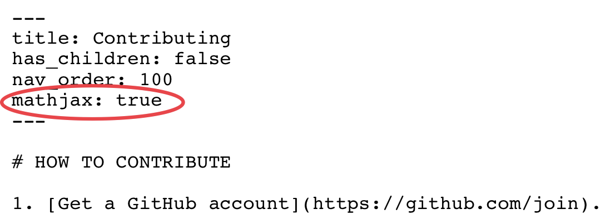

<iframe width="560" height="315"
src="https://www.youtube.com/embed/zGQDlKQcPhg"
frameborder="0"
allow="accelerometer; autoplay; encrypted-media; gyroscope; picture-in-picture"
allowfullscreen></iframe>

# HOW TO CONTRIBUTE

1. [Get a GitHub account](https://github.com/join). You do not need to know Git to contribute to LOST, but you do need a GitHub account.
2. Read the [Guide to GitHub Markdown](https://guides.github.com/features/mastering-markdown/) which will show the syntax that is used on LOST pages.
3. Read the below LOST Writing Guide, which shows what a good LOST page looks like from top to bottom. Even if you are just adding another language to an existing page, be sure to read the Implementations section at the bottom.
4. Explore LOST using the navigation bar on the left, find a page that needs to be expanded, and add more content. Or find one that doesn't exist but should (perhaps on the [Desired Nonexistent Pages list]({{ "/Desired_Nonexistent_Pages/desired_nonexistent_pages.html" | relative_url }}), and write it yourself! Go to the [GitHub Repository](https://github.com/LOST-STATS/LOST-STATS.github.io) for LOST to find the appropriate file to edit or folder to create your new file in.
5. If you are a "Contributor" to the project, you can make your edits and changes directly to the repository. If not, you will need to issue a [pull request](https://help.github.com/en/github/collaborating-with-issues-and-pull-requests/creating-a-pull-request) to get your work on LOST. We will add you as a contributor after your first accepted pull request. If you don't know Git or how to do a pull request, please post in [Issues](https://github.com/LOST-STATS/LOST-STATS.github.io/issues) asking to be added as a contributor so you can edit LOST directly.
6. If you've made a new page, make sure it's saved as a `.md` file, put it in the appropriate folder, and add Navigation Information at the top (see below). If you've written a Desired Nonexistent Page, be sure to remove it from the [list]({{ "/Desired_Nonexistent_Pages/desired_nonexistent_pages.html" | relative_url }}). Or, if your page links to some new nonexistent pages, add those to the list! Also, try to see if other pages have attempted to link to the page you're working on, and update their links so they go to the right place.

# LOST WRITING GUIDE

A LOST page is intended to be a *set of instructions for performing a statistical technique*, where "statistical technique" is broadly defined as "the things you do in statistical software", which includes everything from loading data to estimating models to cleaning data to visualization to reproducible notebooks.

After someone reads a LOST page, they should have a decent idea of:

- How to implement at least a basic version of what they want to do in the language/software they're using
- What common pitfalls there might be in what they're doing
- What are the pros and cons of meaningfully-different ways of doing the same thing, if relevant
- Given what they're doing, what else should they consider doing (for example, if they're running a regression discontinuity design, you might suggest they also run a test for bunching on either side of the cutoff)

Things to remember while writing:

- Be as clear as possible. You're writing a set of instructions, in effect. People should be able to follow them.
- The technical ability of the reader may vary by page. People reading a LOST page about how to calculate a mean probably have little experience with their software and will need a lot of hand-holding. You can assume that people reading a LOST page about Markov-Chain Monte Carlo methods probably already have a fairly solid background.

## Markdown

LOST pages are written in Markdown. Markdown is a lightweight and easy-to-use syntax for styling your writing. It includes conventions for

```markdown
Syntax highlighted code block

# Header 1
## Header 2
### Header 3

- Bulleted
- List

1. Numbered
2. List

**Bold** and _Italic_ and `Code` text


```

Note that links in LOST are *relative links* - when linking to another LOST page, don't use the full URL. Instead of regular-markdown

```markdown
[Page](url)
```

instead do, for example:

```markdown
{{ "/Category/page.html" | relative_url }}
```

For more details see [GitHub Flavored Markdown](https://guides.github.com/features/mastering-markdown/).

## Math

Math is rendered with MathJax, which provides support for $$\LaTeX$$ math formatting. To use on a specific page, make sure that the [YAML](#navigation-information) at the top on the underlying Markdown (i.e. .md) file includes a line saying `mathjax: true`. This should already be the default on most existing pages, but it is worth emphasising. For example, here is a screenshot of the "Contributing.md" file that you are reading right now.



After that, equations and other math sections can be delimited with two dollar symbol _pairs_. For example, `$$x = \frac{1}{2}$$` is rendered inline as $$x = \frac{1}{2}$$. Similarly, we can render math in display mode (i.e. as a distinct block) by wrapping the dollar symbol pairs on separate lines. For example,

```
$$
y =  \beta_0 + \beta_1 x + \beta_2 x^2 + \epsilon
$$
```

is rendered as display math:

$$
y =  \beta_0 + \beta_1 x + \beta_2 x^2 + \epsilon
$$

While we don't include such examples here, note that standard $$\LaTeX$$ math environments such as `\begin{equation} ... \end{equation}` (for numbered equations) and `\begin{align} ... \end{align}` (for aligned equation systems) are all supported. Just remember to wrap them between a pair of dollar symbols. More information about MathJax can be found [here](https://math.meta.stackexchange.com/questions/5020/mathjax-basic-tutorial-and-quick-reference).

# STRUCTURE OF A LOST PAGE

When starting a LOST page, you should copy the [New Page Template](https://github.com/LOST-STATS/LOST-STATS.github.io/blob/source/NewPageTemplate.md). There are four main sections of a LOST page:

## Navigation Information

Your page will begin with what's known as YAML, i.e. something that looks like this:

```
---
title: Observation level
parent: Data Manipulation
has_children: false
nav_order: 1
mathjax: true
---
```

You don't need to worry too much about YAML syntax (here's the [Wikipedia entry](https://en.wikipedia.org/wiki/YAML) for those interested). The important thing is that the YAML provides a set of very basic instructions for the website navigation and page structure. Make sure to fill in the `title` with a relevant and brief title. Also be sure to put the appropriate name for the `parent` &mdash; this will ensure that your page shows up in the appropriate spot in the navigation structure. Options for `parent` include:

* Data Manipulation
* Geo-Spatial
* Machine Learning
* Model Estimation
* Presentation
* Summary Statistics
* Time Series
* Other

For the most part, you should generally ignore `has_children`. (An exception is if you are creating a new section that *does* have new child pages, but then you are probably better off filing an issue with us to make sure this is done correctly.) You can also ignore `nav_order` &mdash; leaving this at 1 for everything will put everything in alphabetical order.

## Introduction

This is an introduction to the technique. Most of the time this will be just a few sentences about what it is and does, and perhaps why it is used. However, in cases of more niche or complex material, there may be a reason to include more detailed information or general non-language-specific instructions here. In general, however, for more detailed explanations or discussions of statistical properties, you can always just link to an outside trusted source like Wikipedia or a (non-paywalled) academic paper.

## Keep in Mind

This is a list of details and reminders for people using the method, especially if they are not yet an expert at it or if the detail is not well-known. This may include:

- Important assumptions that an estimation method makes.
- Notes about interpreting the results.
- Settings where the technique *seems* like it might be a good idea, but actually isn't.
- Features of the technique that might surprise users or be unexpected.
- Rules of thumb for use ("you will want to set the number of bootstrap samples to at least 1,000 (citation)")

## Also Consider

This is a list of *other* techniques that are commonly used *in addition to* this page's technique, or *as an alternative to* this page's technique. If not obvious, include a very brief explanation of why you might want to use that other technique in addition to/instead of the current one. Note that you can link to another LOST page even if that page doesn't exist yet. Maybe it will inspite someone to write it!

For example, pages about estimation techniques might list standard robustness tests to be used in addition to the technique, or adjustments to standard errors they might want to use. A page about a data visualization technique might include a link to a page about setting color palettes to be used in addition.

Or, they might list an alternative technique that might be used if a certain assumption fails ("This technique requires continuous variables. So if your data is discrete, use this other method.").

To link to other LOST pages (even if they don't exist yet &mdash; don't forget to add these to [Desired Nonexistent Pages]({{ "/Desired_Nonexistent_Pages/desired_nonexistent_pages.html" | relative_url }})!), we ask that you spell the `url` in a way our markdown renderer understands. Specifically, please write the `url` as `{{ "/Category_name/page.html" | relative_url }}`.

For example, if you'd like to link to this page, please write `[Guide to Contributing]({{ "/Contributing/Contributing.html" | relative_url}})` which will then be rendered as [Guide to Contributing]({{ "/Contributing/Contributing.html" | relative_url}}).

## Implementations

Implementations contains multiple subsections, one for each statistical software environment/programming language that the technique can be implemented in.

- Implementations should be listed in **alphabetical order of software/language**. eViews, then Python, then R, then SAS, then Stata, etc.
- For each language, include well-commented and **as-brief-as-reasonably-possible** example code that provides an example of performing the technique. Readers should be able to copy the code and have it run the technique from beginning to end, including steps like loading in data if necessary. See existing pages for examples.
- If someone else on the internet has already written a clear, thorough, and general implementation example, then linking to it is perfectly fine! This includes StackOverflow/StackExchange answers, which you can link to using the [share button](https://meta.stackexchange.com/a/45598). Extremely long demonstrations for super-complex methods may be better left as links only (perhaps with a tiny example pulled out and put on LOST). If the example is short enough, though, including the example directly in the LOST page is preferable, with link attribution of the source, so readers don't have to go elsewhere.
- Avoid creating a long list of examples showing every variant or optional setting of the technique. Instead, focus on one main example, with variants included only if they are especially important. If you like, you can mention in comments additional useful options/settings the reader might want to look into and what they do.
- If the technique requires that a package or library be installed, include the code for installing the package in a comment (or if you are using a language where libraries cannot be installed inside the code, include a comment directing the user to install the library).
- If a given language has *multiple ways* of performing the same technique, ideally report only one "best" method, whatever that might be. If other methods are only different in trivial ways, then you can describe them as being alternatives, but avoid providing examples for them. If other methods are different in important ways, then include an example for each, with text explanations of what is different about them. If two contributors seriously disagree about which way is best, then they're probably different in some meaningful way so you can include both as long as you can explain what that difference is.
- It is fine to add implementations for software that only has a graphical interface rather than code (such as Excel) using screenshots. Be sure to keep images well-cropped and small so they don't crowd the page. If your graphical instructions are necessarily very long, consider posting them as a blog post somewhere and just put a link to that post in Implementations.

**Images**

Images can be added to Implementation sections if relevant, for example if you're working with GUI-only software, or demonstrating the output of a data visualization technique.

How can you add these images? You can upload the images somewhere on the internet that allows image linking, and include the image in your instructions with ``. Ideally, upload the image directly to the `Images/name-of-your-page/` subfolder of whatever directory you're working in, and link to the images there.

Please be sure to add alt text to images for sight-impaired users. Image filenames should make reference to the language used to make them, i.e. `python_scatterplot.png`.

**Data**

*Ideally*, the same data set will be uploaded to LOST directly in a format accessible by many languages (like CSV) in the `Data/name-of-your-page/` subfolder of whatever directory you're wokring in, and then that data can be used for implementation in all languages on the page. This is not required, but is encouraged.

# FREQUENTLY ASKED QUESTIONS

- **What techniques are important enough to be their own page?** This is a little subjective, but if you're writing about X, which is a minor option/variant of Y, then you can just include it on the Y page. If X is a *different technique* or a variant of Y that is used in different circumstances or produces meaningfully different output, then give X its own page.
- **How should I title my page?** Pick a single, concise description of the technique you're talking about. If there are multiple ways to refer to the technique you're doing, pick one. You will also need to select a file name, which should be in lower_case_with_underscores.md and you might want to make a bit shorter. So Ordinary Least Squares (Linear Regression) might be the title and H1 heading, and ordinary_least_squares.md might be the file name.
- **What languages can I include in Implementations?** Any language is valid as long as it's something people actually do statistical analysis in. Don't include something just because you *can* (I mean, you can technically do OLS in assembly but is that useful for anyone?), but because you think someone will find it useful.
- **Should I include the output of my code?** For data visualization, yes! Just keep the images relatively small so they don't crowd the page. See the Implementations section above for how to add images. If your output is not visual, there's probably no need to include output unless you think that it is especially important for some technique.
- **How can I discuss what I'm doing with other contributors?** Head to the [Issues](https://github.com/LOST-STATS/LOST-STATS.github.io/issues) page and find (or post) a thread with the title of the page you're talking about.
- **How can I [add an image/link to another LOST page/add an external link/bold text] in the LOST wiki?** See the Markdown section above.
- **I want to contribute but I do not like all the rules and structure on this page. I don't even want my FAQ entry to be a question. Just let me write what I want.** If you have valuable knowledge about statistical techniques to share with people and are able to explain things clearly, I don't want to stop you. So go for it. Maybe post something in [Issues](https://github.com/LOST-STATS/LOST-STATS.github.io/issues) when you're done and perhaps someone else will help make your page more consistent with the rest of the Wiki. I mean, it would be nicer if you did that yourself, but hey, we all have different strengths, right?
