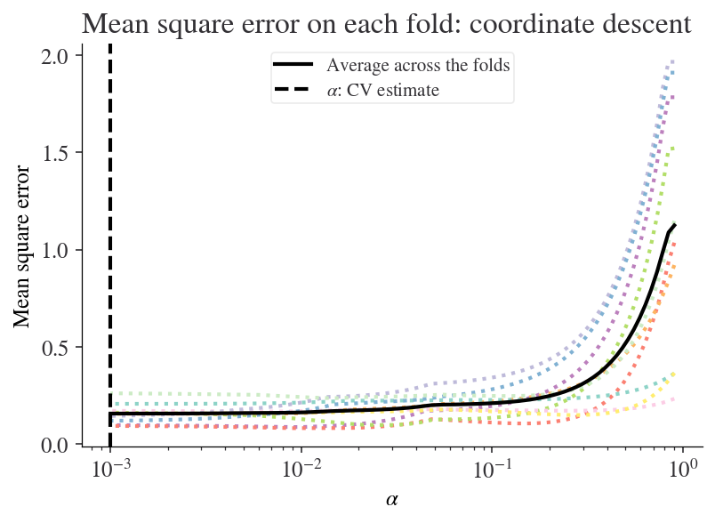

# Penalized Regression

When running a regression, especially one with many predictors, the results have a tendency to overfit the data, reducing out-of-sample predictive properties. 

Penalized regression eases this problem by forcing the regression estimator to shrink its coefficients towards 0 in order to avoid the "penalty" term imposed on the coefficients. This process is closely related to the idea of Bayesian shrinkage, and indeed standard penalized regression results are equivalent to regression performed using [certain Bayesian priors](https://amstat.tandfonline.com/doi/abs/10.1198/016214508000000337?casa_token=DE6O93Bz7uUAAAAA:Ff_MiPXvPH32NA2hnGtZtqb8grXEiEqF0fdO3B0p_a6wOaqRciCZ4ASwxn69gdOb93Lbt-HSyK1o4As).

Regular OLS selects coefficients $$\hat{\beta}$$ to minimize the sum of squared errors:

$$
\min\sum_i(y_i - X_i\hat{\beta})^2
$$

Non-OLS regressions similarly select coefficients to minimize a similar objective function. Penalized regression adds a penalty term $$\lambda\lVert\beta\rVert_p$$ to that objective function, where $$\lambda$$ is a tuning parameter that determines how harshly to penalize coefficients, and $$\lVert\beta\rVert_p$$ is the $$p$$-norm of the coefficients, or $$\sum_j\lvert\beta\rvert^p$$.

$$
\min\left(\sum_i(y_i - X_i\hat{\beta})^2 + \lambda\left\lVert\beta\right\rVert_p \right)
$$

Typically $$p$$ is set to 1 for LASSO regression (least absolute shrinkage and selection operator), which has the effect of tending to set coefficients to 0, i.e. model selection, or to 2 for Ridge Regression. Elastic net regression provides a weighted mix of LASSO and Ridge penalties, commonly referring to the weight as $$\alpha$$. 

## Keep in Mind

- To avoid being penalized for a constant term, or by differences in scale between variables, it is a very good idea to standardize each variable (subtract the mean and divide by the standard deviation) before running a penalized regression.
- Penalized regression can be run for logit and other kinds of regression, not just linear regression. Using penalties with general linear models like logit is common.
- Penalized regression coefficients are designed to improve out-of-sample prediction, but they are biased. If the goal is estimation of a parameter, rather than prediction, this should be kept in mind. A common procedure is to use LASSO to select variables, and then run regular regression models with the variables that LASSO has selected.
- The $$\lambda$$ parameter is often chosen using cross-validation. Many penalized regression commands include an option to select $$\lambda$$ by cross-validation automatically.
- LASSO models commonly include variables along with polynomial transformation of those variables and interactions, allowing LASSO to determine which transformations are worth keeping.

## Also Consider

- If it is not important to estimate coefficients but the goal is simply to predict an outcome, then there are many other [machine learning]({{ "/Machine_Learning/Machine_Learning.html" | relative_url }}) methods that do so, and in some cases can handle higher dimensionality or work with smaller samples.

# Implementations

## Python

This is an example of running penalised regressions in Python. The main takeaways are that the ubiquitous machine learning package [**sklearn**](https://scikit-learn.org/stable/index.html) can perform lasso, ridge, and elastic net regressions. In the example below, we'll see all three in action. The level of penalisation will be set automatically by cross-validation, although a user may also supply the number directly.

This example will use the seaborn package (for data), the patsy package (to create matrices from formulae), the matplotlib package (for plotting), the pandas package (for data manipulation), and the [**sklearn**](https://scikit-learn.org/stable/index.html) package (for machine learning). To run the example below, you may need to first install these packages. First, we need to import these packages for use.


```python?example=penreg
import seaborn as sns
from patsy import dmatrices, dmatrix
from sklearn.preprocessing import StandardScaler
from sklearn.linear_model import LassoCV, ElasticNetCV, RidgeCV
import matplotlib.pyplot as plt
import pandas as pd
```


Now let's load the data and transform it into a vector of endogeneous variables, and a matrix of exogenous variables. Using patsy, we'll ask for all interaction variables among sepal width, petal length, and petal width (and exclude having an intercept).


```python?example=penreg
iris = sns.load_dataset("iris")
formula = ("sepal_length ~ (sepal_width + petal_length + petal_width)**2 - 1")
y, X = dmatrices(formula, iris)
```

Some machine learning algorithms are more performant with data that are scaled before being used. One should be careful when scaling data if using test and training sets; here, we're not worried about a test set though, so we just use the standard scaler (which transforms data to have 0 mean and unit standard deviation) on all of the $X$ and $y$ data.


```python?example=penreg
scale_X = StandardScaler().fit(X).transform(X)
scale_y = StandardScaler().fit(y).transform(y)
scale_y = scale_y.ravel()  # ravel collapses a (150, 1) vector to (150,)
```

Now we run lasso with cross-validation.


```python?example=penreg
reg_lasso = LassoCV(cv=10).fit(scale_X, scale_y)
```

Let's display the results so we can see for which value of $\alpha$ the lowest mean squared error occurred. Note that sklearn uses the convention that $\alpha$ (rather than $\lambda$) is the shrinkage parameter.


```python?example=penreg
EPSILON = 1e-4  # This is to avoid division by zero while taking the base 10 logarithm
plt.figure()
plt.semilogx(reg_lasso.alphas_ + EPSILON, reg_lasso.mse_path_, ':')
plt.plot(reg_lasso.alphas_ + EPSILON, reg_lasso.mse_path_.mean(axis=-1), 'k',
         label='Average across the folds', linewidth=2)
plt.axvline(reg_lasso.alpha_ + EPSILON, linestyle='--', color='k',
            label=r'$\alpha$: CV estimate')
plt.legend()
plt.xlabel(r'$\alpha$')
plt.ylabel('Mean square error')
plt.title('Mean square error on each fold: coordinate descent ')
plt.axis('tight')
plt.show()
```




Let's look at the coefficients that are selected with this optimal value of $\alpha$ (which you can access via `reg_lasso.alpha_`):


```python?example=penreg
for coef, name in zip(reg_lasso.coef_, dmatrix(formula.split('~')[1], iris).design_info.term_names):
    print(f'Coeff {name} = {coef:.2f}')
```

    Coeff sepal_width = 0.36
    Coeff petal_length = 1.38
    Coeff petal_width = -0.39
    Coeff sepal_width:petal_length = -0.00
    Coeff sepal_width:petal_width = -0.32
    Coeff petal_length:petal_width = 0.33


Now let's see what coefficients we get with ridge regression and elastic net (a mixture between ridge and lasso; here we use the default setting of a half-mixture between the two).


```python?example=penreg
reg_elastic = ElasticNetCV(cv=10).fit(scale_X, scale_y)
reg_ridge = RidgeCV(cv=10).fit(scale_X, scale_y)
# For convenient comparison, let's pop these into a dataframe
df = pd.DataFrame({'Lasso': reg_lasso.coef_,
                   'Elastic Net (0.5)': reg_elastic.coef_,
                   'Ridge': reg_ridge.coef_},
                  index=dmatrix(formula.split('~')[1], iris).design_info.term_names).T
df[r'$\alpha$'] = [reg_lasso.alpha_, reg_elastic.alpha_, reg_ridge.alpha_]
df = df.T
df
```

<div>
<table border="1" class="dataframe">
  <thead>
    <tr style="text-align: right;">
      <th></th>
      <th>Lasso</th>
      <th>Elastic Net (0.5)</th>
      <th>Ridge</th>
    </tr>
  </thead>
  <tbody>
    <tr>
      <th>sepal_width</th>
      <td>0.362891</td>
      <td>0.357877</td>
      <td>0.288003</td>
    </tr>
    <tr>
      <th>petal_length</th>
      <td>1.383851</td>
      <td>1.321840</td>
      <td>0.931508</td>
    </tr>
    <tr>
      <th>petal_width</th>
      <td>-0.386780</td>
      <td>-0.320669</td>
      <td>-0.148416</td>
    </tr>
    <tr>
      <th>sepal_width:petal_length</th>
      <td>-0.000000</td>
      <td>0.039810</td>
      <td>0.363751</td>
    </tr>
    <tr>
      <th>sepal_width:petal_width</th>
      <td>-0.322053</td>
      <td>-0.362515</td>
      <td>-0.497244</td>
    </tr>
    <tr>
      <th>petal_length:petal_width</th>
      <td>0.327846</td>
      <td>0.321951</td>
      <td>0.326384</td>
    </tr>
    <tr>
      <th>α</th>
      <td>0.000901</td>
      <td>0.001802</td>
      <td>1.000000</td>
    </tr>
  </tbody>
</table>
</div>


## R

We will use the **glmnet** package.

```r
# Install glmnet and tidyverse if necessary
# install.packages('glmnet', 'tidyverse')

# Load glmnet
library(glmnet)

# Load iris data
data(iris)

# Create a matrix with all variables other than our dependent vairable, Sepal.Length
# and interactions. 
# -1 to omit the intercept
M <- model.matrix(lm(Sepal.Length ~ (.)^2 - 1, data = iris))
# Add squared terms of numeric variables
numeric.var.names <- names(iris)[2:4]
M <- cbind(M,as.matrix(iris[,numeric.var.names]^2))
colnames(M)[16:18] <- paste(numeric.var.names,'squared')

# Create a matrix for our dependent variable too
Y <- as.matrix(iris$Sepal.Length)

# Standardize all variables
M <- scale(M)
Y <- scale(Y)


# Use glmnet to estimate penalized regression
# We pick family = "gaussian" for linear regression;
# other families work for other kinds of data, like binomial for binary data
# In each case, we use cv.glmnet to pick our lambda value using cross-validation
# using nfolds folds for cross-validation
# Note that alpha = 1 picks LASSO
cv.lasso <- cv.glmnet(M, Y, family = "gaussian", nfolds = 20, alpha = 1)
# We might want to see how the choice of lambda relates to out-of-sample error with a plot
plot(cv.lasso)
# After doing CV, we commonly pick the lambda.min for lambda, 
# which is the lambda that minimizes out-of-sample error
# or lambda.1se, which is one standard error above lambda.min,
# which penalizes more harshly. The choice depends on context.
lasso.model <- glmnet(M, Y, family = "gaussian", alpha = 1, lambda = cv.lasso$lambda.min)
# coefficients are shown in the beta element. . means LASSO dropped it
lasso.model$beta

# Running Ridge, or mixing the two with elastic net, simply means picking
# alpha = 0 (Ridge), or 0 < alpha < 1 (Elastic Net)
cv.ridge <- cv.glmnet(M, Y, family = "gaussian", nfolds = 20, alpha = 0)
ridge.model <- glmnet(M, Y, family = "gaussian", alpha = 0, lambda = cv.ridge$lambda.min)

cv.elasticnet <- cv.glmnet(M, Y, family = "gaussian", nfolds = 20, alpha = .5)
elasticnet.model <- glmnet(M, Y, family = "gaussian", alpha = .5, lambda = cv.elasticnet$lambda.min)
```

## Stata

Penalized regression is one of the few machine learning algorithms that Stata does natively. This requires Stata 16. If you do not have Stata 16, you can alternately perform some forms of penalized regression by installing the **lars** package using **ssc install lars**.

```stata
* Use NLSY-W data
sysuse nlsw88.dta, clear

* Construct all squared and interaction terms by loop so we don't have to specify them all
* by hand in the regression function
local numeric_vars = "age grade hours ttl_exp tenure"
local factor_vars = "race married never_married collgrad south smsa c_city industry occupation union"

* Add all squares
foreach x in `numeric_vars' {
	g sq_`x' = `x'^2
}

* Turn all factors into dummies so we can standardize them
local faccount = 1
local dummy_vars = ""
foreach x in `factor_vars' {
	xi i.`x', pre(f`count'_)
	local count = `count' + 1
}

* Add all numeric-numeric interactions; these are easy
* factor interactions would need a more thorough loop
forvalues i = 1(1)5 {
	local next_i = `i'+1
	forvalues j = `next_i'(1)5 {
		local namei = word("`numeric_vars'",`i')
		local namej = word("`numeric_vars'",`j')
		g interact_`i'_`j' = `namei'*`namej'
	}
}

* Standardize everything
foreach var of varlist `numeric_vars' f*_* interact_* {
	qui summ `var'
	qui replace `var' = (`var' - r(mean))/r(sd)
}

* Use the lasso command to run LASSO
* using sel(cv) to select lambda using cross-validation
* we specify a linear model here, but logit/probit/poisson would work
lasso linear wage `numeric_vars' f*_* interact_*, sel(cv)
* get list of included coefficients
lassocoef

* We can use elasticnet to run Elastic Net
* By default, alpha will be selected by cross-validation as well
elasticnet linear wage `numeric_vars' f*_* interact_*, sel(cv)
```
