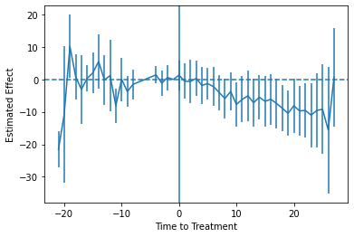
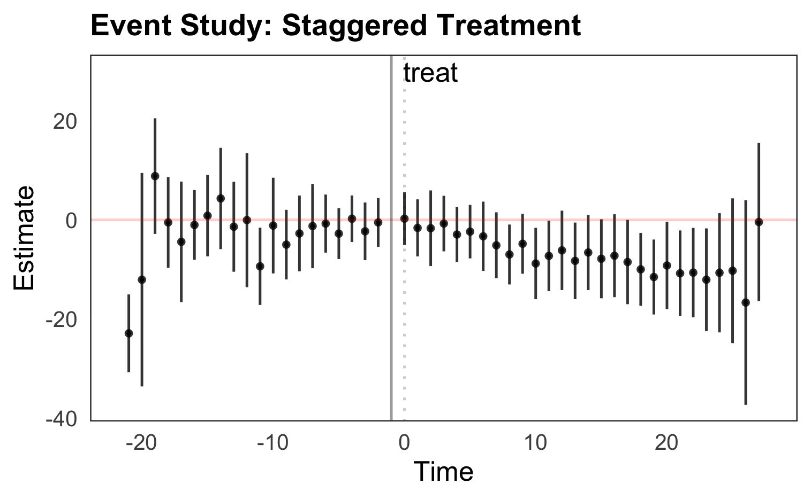
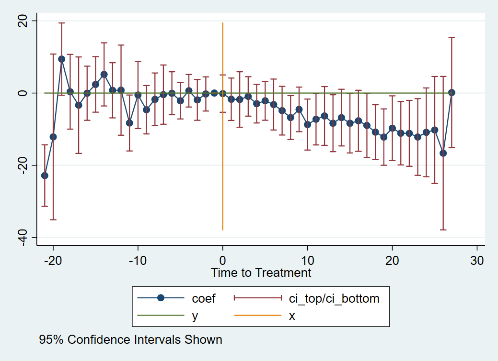

# Difference-in-Differences Event Study / Dynamic Difference-in-Differences

A Difference-in-Difference (DID) event study, or a Dynamic DID model, is a useful tool in evaluating treatment effects of the pre- and post- treatment periods in your respective study. However, since treatment can be staggered - where the treatment group are treated at different time periods - it might be challenging to create a clean event study.

In the following code, we will learn how to create a DID event study when treatment is staggered. If there is only one treatment period, the same methodology as described below can be applied. 

**Importantly**, while this page uses data from a staggered-treatment design, [Sun and Abraham (2020)](https://www.sciencedirect.com/science/article/pii/S030440762030378X) showed that basic event-study estimation can be biased in this setup. The code below should be used only in cases where treatment occurs at a single time period. Where possible, the code will also show how to apply the Sun and Abraham estimator that fixes this problem, although keep in mind that Sun and Abraham does not allow covariates.

The regression that DID event studies are based aroud is:

$$ 
Y_{gt} = \alpha + \Sigma_{k=T_0}^{-2}\beta_k\times treat_{sk}+\Sigma_{k=0}^{T_1}\beta_k\times treat_{sk}+ X_{st}\Gamma+\phi_s+\gamma_t+\epsilon_{st}
$$

Where: 

 - $$treat_{sk}$$ is a dummy variable, equaling 1 if the observation's periods to their first treated period is the same value as `k`; 0 otherwise (and 0 for all never-treated groups). 

 - $$T_0$$ and $$T_1$$ are the lowest and highest number of leads and lags to consider surrouning the treatment period, respectively.
 
 - $$X`$$ are controls
 
 - $$\phi$$ and $$\gamma$$ are state and time fixed effects 
 
 - Estimation is generally performed with standard errors clustered at the group level 

Important notes on the regression:

- The point of the regression is to show for each period before and after treatment that the coefficients on the pre-treated periods are statistically insignificant

- Showing the control and treated groups are statistically the same before treatment ($\beta=0$ in pre-treatment periods) supports, though does not prove, the parallel trends assumption in DID estimation.

- One of the time periods must be dropped to avoid perfect multicollinearity (as in most fixed-effects setups). In most event studies, the -1 time lag is used as the dropped reference.

## Keep in Mind

Mechanically, an event study is a graphical illustration of the point estimates and confidence intervals of the regression for each time period before and after the treatment period. It's especially relevant in the DID environment as the point estimates are the average mean differences between the treated and control groups, which provides further evidence of the credibility in assuming parallel trends. 

## Also Consider

- [2x2 Difference-in-Differences]({{ "/Model_Estimation/Research_Design/two_by_two_difference_in_difference.html" | relative_url }})
- A great resource for learning more about DID and event study theory is at [Causal Inference: The Mixtape](https://mixtape.scunning.com/difference-in-differences.html#providing-evidence-for-parallel-trends-through-event-studies-and-parallel-leads). 

# Implementations

All implementations use the same data, which comes from [Stevenson and Wolfers (2006)](http://users.nber.org/~jwolfers/papers/bargaining_in_the_shadow_of_the_law.pdf) by way of [Clarke & Schythe (2020)](http://ftp.iza.org/dp13524.pdf). This data is a balanced panel from 1964 through 1996 of the United States no-fault divorce reforms and female suicide rates. You can directly download the data [here](http://www.damianclarke.net/stata/bacon_example.dta). 

Column `_nfd` in the data  specifies the year in which the law went into effect for the respective state. We use this column to identify the lead and lags with respect to year of treatment. `pcinc`, `asmrh`, and `cases` are controls.

Note that there are some states in which `_nfd` is empty. These states never received treatment, and thus exist as a control. 

## Python

Python makes dealing with lots of interaction terms like we have here a little painful, but we can iterate to do a lot of the work for us.

```python
import pandas as pd
import numpy as np
import matplotlib as plt
import linearmodels as lm

# Read in data
df = pd.read_stata("https://raw.githubusercontent.com/LOST-STATS/LOST-STATS.github.io/master/Model_Estimation/Data/Event_Study_DiD/bacon_example.dta")

# create the lag/lead for treated states
# fill in control obs with 0
# This allows for the interaction between `treat` and `time_to_treat` to occur for each state. 
# Otherwise, there may be some missingss and the estimations will be off.  
df['time_to_treat'] = df['year'] - df['_nfd']
df.loc[pd.isna(df['_nfd']), 'time_to_treat'] = 0

# this will determine the difference
# btw controls and treated states 
df['treat'] = ~pd.isna(df['_nfd'])


# Create our interactions by hand,
# skipping -1, the last one before treatment
time_periods = pd.unique(df['time_to_treat'])

for i in time_periods:
  if i != -1:
	# Be sure not to include the decimal parts in the name
	name = 'INX'+str(np.int64(i))
	# or the minuses
	name = name.replace('-','m')
	df[name] = 1*df['treat']
	df.loc[df['time_to_treat'] != i, name] = 0

# Set our individual and time (index) for our data
df = df.set_index(['stfips','year'])

# Estimate the regression
# We can save ourselves some time by creating the regression formula automatically
inxnames = df.columns[range(13,df.shape[1])]
formula = 'asmrs ~ ' + ' + '.join(inxnames) + ' + pcinc + asmrh + cases + EntityEffects + TimeEffects'

mod = lm.PanelOLS.from_formula(formula,df)

# Specify clustering when we fit the model
clfe = mod.fit(cov_type = 'clustered',
	cluster_entity = True)

# Look at regression results
clfe.summary
```

Now we can plot the results with **matplotlib**. Two common approaches are to include vertical-line confidence intervals with `errorbar()` or to include a confidence interval ribbon with `fill_between()`. I'll show the `errorbar()` version.

```python
# Get coefficients and CIs
res = pd.concat([clfe.params, clfe.std_errors], axis = 1)
# Scale standard error to 95% CI
res['ci'] = res['std_error']*1.96

# Add our time values
res['time_to_treat'] = res.index
# We only want time interactions
res = res.iloc[range(0, res.shape[0]-3)]
# Turn the coefficient names back to numbers
res['time_to_treat'] = res['time_to_treat'].apply(lambda x: x.replace('INX',''))
res['time_to_treat'] = res['time_to_treat'].apply(lambda x: x.replace('m','-'))
res['time_to_treat'] = res['time_to_treat'].astype(int)

# And add our reference period back in
reference = pd.DataFrame([[0,0,0,-1]],
              columns = ['parameter',
                         'std_error',
                         'ci',
                         'time_to_treat'])
res = pd.concat([res, reference])

# For plotting, sort
res = res.sort_values('time_to_treat')

# Plot the estimates as connected lines with error bars

plt.errorbar(x = 'time_to_treat', y = 'parameter',
                    yerr = 'ci', data = res)
# Add a horizontal line at 0
plt.axhline(0, linestyle = 'dashed')
# And a vertical line at the treatment time
plt.axvline(0)
plt.xlabel('Time to Treatment')
plt.ylabel('Estimated Effect')
```

Which produces:



Of course, as earlier mentioned, this analysis is subject to the critique by Sun and Abraham (2020). You want to calculate effects separately by time-when-treated, and then aggregate to the time-to-treatment level properly, avoiding the way these estimates can "contaminate" each other in the regular model. You are on your own for this process in Python, though. Read the paper (and the back-end code from the R or Stata implementations listed below).

## R 

First, load packages and the data 

```r
library(pacman)
p_load(dplyr, fixest, tidyverse, broom, haven)

#Load and prepare data
bacon_df <- read_dta("https://raw.githubusercontent.com/LOST-STATS/LOST-STATS.github.io/master/Model_Estimation/Data/Event_Study_DiD/bacon_example.dta") %>%
  mutate(
  # create the lag/lead for treated states
  # fill in control obs with 0
  # This allows for the interaction between `treat` and `time_to_treat` to occur for each state. 
  # Otherwise, there may be some NAs and the estimations will be off.  
  time_to_treat =ifelse(is.na(`_nfd`),0,year - `_nfd`),
  # this will determine the difference
  # btw controls and treated states 
  treat = ifelse(is.na(`_nfd`),0,1)
  )
```

Also, while it's not necessary given how we're about to use the **fixest** package, if you're interested in creating a dummy variable for each lead/lag in your data set, you can use the package **fastDummies** and `bacon_df <- dummy_cols(bacon_df, select_column = "time_to_treat")`.

We will run the event-study regression using `feols()` from the **fixest** package. **fixest** is very fast, contains support for complex fixed-effects interactions, selecting our own reference group like we need with `i()`, and will also help run the Sun and Abraham (2020) estimator.

```r
m_1 <- feols(asmrs ~ 
    # The time-treatment interaction terms
	i(treat, time_to_treat, ref=-1) + 
	# Controls
	pcinc + asmrh + cases 
	# State and year fixed effects
	| stfips + year, 
	# feols clusters by the first fixed effect anyway, just making that clear
	cluster=~stfips, data=bacon_df)
# Now turn the results into a data frame with a year column for easy plotting
event_1 <- tidy(m_1, conf.int = TRUE) %>% 
	# For plotting purposes, we only want the terms that reference years
	# and not the controls 
    mutate(year =  as.numeric(parse_number(term))) %>%
	filter(!is.na(year))
```

Now we can plot the results with **ggplot2**. Two common approaches are to include vertical-line confidence intervals with `geom_pointrange()` or to include a confidence interval ribbon with `geom_ribbon()`. I'll show the `geom_pointrange()` version, but this is easy to swap out. 

Now, you could just simply use `coefplot(m_1)` from **fixest** and be done with it! This will create the event-study plot for you. Done. But if you want to maybe do some **ggplot2** styling afterwards, or do some by-hand tweaks, you can do it yourself:

```r
event_1 %>%
    ggplot(mapping = aes(x = year, y = estimate, 
	                     ymin = conf.low, ymax = conf.high))+
      geom_pointrange(position = position_dodge(width = 1), 
	  # Optional decoration:
	  color="black", fatten=.5, alpha=.8) +
	  # Add a line marker for y = 0 (to see if the CI overlaps 0)
      geom_hline(yintercept=0, color = "red",alpha=0.2)+
	  # A marker for the last pre-event period
      geom_vline(xintercept = -1, color = "black", size=0.5, alpha=0.4) +
	  # And the event period
      geom_vline(xintercept = 0, linetype="dotted", color = "black", size=0.5, alpha=0.2)+
	  # Additional decoration:
	  theme_bw()+
	  theme(
		plot.title = element_text(face = "bold", size = 12),
		legend.background = element_rect(fill = "white", size = 4, colour = "white"),
		legend.justification = c(0, 1),
		legend.position = c(0, 1),
		axis.ticks = element_line(colour = "white", size = 0.1),
		panel.grid.major = element_line(colour = "white", size = 0.07),
		panel.grid.minor = element_blank()
	  )+
		annotate("text", x = c(0,2), y=30, label = c("","treat"))+
		 labs(title="Event Study: Staggered Treatment", y="Estimate", x="Time")
```

This results in:



Another common option in these graphs is to link all the individual point estimates with a line. This can be done by adding `+geom_line()` right after the `geom_pointrange()` call.

Of course, as earlier mentioned, this analysis is subject to the critique by Sun and Abraham (2020). We can also use **fixest** to estimate the Sun and Abraham estimator to calculate effects separately by time-when-treated, and then aggregate to the time-to-treatment level properly, avoiding the way these estimates can "contaminate" each other in the regular model.

```r
# see help(aggregate.fixest)
# As Sun and Abraham indicate, drop any always-treated groups
sun_df <- bacon_df %>%
  filter(`_nfd` > min(year) | !treat) %>%
  # and set time_to_treat to -1000 for untreated groups
  mutate(time_to_treat = case_when(
    treat == 0 ~ -1000,
    treat == 1 ~ time_to_treat
  )) %>%
  # and create a new year-treated variable that's impossibly far in the future
  # for untreated groups
  mutate(year_treated = case_when(
    treat == 0 ~ 10000,
    treat == 1 ~ `_nfd`
  )) %>%
  # and a shared identifier for year treated and year
  mutate(id = paste0(year_treated, ':', year))
  
# Read the Sun and Abraham paper before including controls as I do here
m_2 <- feols(asmrs ~ 
               # This time, interact time_to_treatment with year treated
               # Dropping as reference the -1 period and the never-treated
               i(time_to_treat, f2 = year_treated, drop = c(-1, -1000)) +
               # Controls
               pcinc + asmrh + cases
             # Fixed effects for year_treated-year and year
             # IMPORTANT NOTE:
             # the FE should actually be id + year here, but due to the sparseness
             # of the example data, that won't run. But *do* do that in your analysis though
             # See help(aggregate.fixest)
             | year_treated + year, 
             data=sun_df)
# Aggregate the coefficients by group
agg_coef = aggregate(m_2, "(time_to_treat)::(-?[[:digit:]]+)")
# And plot
agg_coef %>%
  as_tibble() %>%
  mutate(conf.low = Estimate - 1.96*`Std. Error`,
         conf.high = Estimate + 1.96*`Std. Error`,
         `Time to Treatment` = c(-21:-2, 0:27)) %>%
  ggplot(mapping = aes(x = `Time to Treatment`, y = Estimate, 
                       ymin = conf.low, ymax = conf.high))+
  geom_pointrange(position = position_dodge(width = 1), 
                  # Optional decoration:
                  color="black", fatten=.5, alpha=.8) +
  geom_line() +
  # Add a line marker for y = 0 (to see if the CI overlaps 0)
  geom_hline(yintercept=0, color = "red",alpha=0.2)+
  # A marker for the last pre-event period
  geom_vline(xintercept = -1, color = "black", size=0.5, alpha=0.4) +
  # And the event period
  geom_vline(xintercept = 0, linetype="dotted", color = "black", size=0.5, alpha=0.2)+
  # Additional decoration:
  theme_bw()+
  labs(title="Event Study: Staggered Treatment with Sun and Abraham (2020) Estimation", y="Estimate", x="Time")
```


## Stata

We can use the **reghdfe** package to help with our two-way fixed effects and high-dimensional data. Install with `ssc install reghdfe` first if you don't have it.

```stata
use "https://raw.githubusercontent.com/LOST-STATS/LOST-STATS.github.io/master/Model_Estimation/Data/Event_Study_DiD/bacon_example.dta", clear

* create the lag/lead for treated states
* fill in control obs with 0
* This allows for the interaction between `treat` and `time_to_treat` to occur for each state. 
* Otherwise, there may be some NAs and the estimations will be off.  
g time_to_treat = year - _nfd
replace time_to_treat = 0 if missing(_nfd)
* this will determine the difference
* btw controls and treated states 
g treat = !missing(_nfd)

* Stata won't allow factors with negative values, so let's shift
* time-to-treat to start at 0, keeping track of where the true -1 is
summ time_to_treat
g shifted_ttt = time_to_treat - r(min)
summ shifted_ttt if time_to_treat == -1
local true_neg1 = r(mean)

* Regress on our interaction terms with FEs for group and year, 
* clustering at the group (state) level
* use ib# to specify our reference group
reghdfe asmrs ib`true_neg1'.shifted_ttt pcinc asmrh cases, a(stfips year) vce(cluster stfips)
```

Now we can plot.

```stata
* Pull out the coefficients and SEs
g coef = .
g se = .
levelsof shifted_ttt, l(times)
foreach t in `times' {
	replace coef = _b[`t'.shifted_ttt] if shifted_ttt == `t'
	replace se = _se[`t'.shifted_ttt] if shifted_ttt == `t'
}

* Make confidence intervals
g ci_top = coef+1.96*se
g ci_bottom = coef - 1.96*se

* Limit ourselves to one observation per quarter
* now switch back to time_to_treat to get original timing
keep time_to_treat coef se ci_*
duplicates drop

sort time_to_treat

* Create connected scatterplot of coefficients
* with CIs included with rcap 
* and a line at 0 both horizontally and vertically
summ ci_top
local top_range = r(max)
summ ci_bottom
local bottom_range = r(min)

twoway (sc coef time_to_treat, connect(line)) ///
	(rcap ci_top ci_bottom time_to_treat)	///
	(function y = 0, range(time_to_treat)) ///
	(function y = 0, range(`bottom_range' `top_range') horiz), ///
	xtitle("Time to Treatment") caption("95% Confidence Intervals Shown")
```

Which produces:



Any further decoration or theming at that point is up to you.

Of course, as earlier mentioned, this analysis is subject to the critique by Sun and Abraham (2020). We can also use **fixest** to estimate the Sun and Abraham estimator to calculate effects separately by time-when-treated, and then aggregate to the time-to-treatment level properly, avoiding the way these estimates can "contaminate" each other in the regular model.

We can estimate the Sun and Abraham method using the **eventstudyinteract** package by Sun herself. Install by installing the **github** package with `net install github, from("https://haghish.github.io/github/")` and then installing **eventstudyinteract** with `github install lsun20/eventstudyinteract`.

See `help eventstudyinteract` for more information.

```stata
* Reload our data since we squashed it to graph
use "https://raw.githubusercontent.com/LOST-STATS/LOST-STATS.github.io/master/Model_Estimation/Data/Event_Study_DiD/bacon_example.dta", clear

* create the lag/lead for treated states
* fill in control obs with 0
* This allows for the interaction between `treat` and `time_to_treat` to occur for each state. 
* Otherwise, there may be some NAs and the estimations will be off.  
g time_to_treat = year - _nfd
replace time_to_treat = 0 if missing(_nfd)
* this will determine the difference
* btw controls and treated states 
g treat = !missing(_nfd)
g never_treat = missing(_nfd)
	
	
* Create relative-time indicators for treated groups by hand
* ignore distant leads and lags due to lack of observations
* (note this assumes any effects outside these leads/lags is 0)
tab time_to_treat
forvalues t = -9(1)16 {
	if `t' < -1 {
		local tname = abs(`t')
		g g_m`tname' = time_to_treat == `t'
	}
	else if `t' >= 0 {
		g g_`t' = time_to_treat == `t'
	}
}

eventstudyinteract asmrs g_*, cohort(_nfd) control_cohort(never_treat) covariates(pcinc asmrh cases) absorb(i.stfips i.year) vce(cluster stfips)

* Get effects and plot
* as of this writing, the coefficient matrix is unlabeled and so we can't do _b[] and _se[]
* instead we'll work with the results table
matrix T = r(table)
g coef = 0 if time_to_treat == -1
g se = 0 if time_to_treat == -1
forvalues t = -9(1)16 {
	if `t' < -1 {
		local tname = abs(`t')
		replace coef = T[1,colnumb(T,"g_m`tname'")] if time_to_treat == `t'
		replace se = T[2,colnumb(T,"g_m`tname'")] if time_to_treat == `t'
	}
	else if `t' >= 0 {
		replace coef =  T[1,colnumb(T,"g_`t'")] if time_to_treat == `t'
		replace se = T[2,colnumb(T,"g_`t'")] if time_to_treat == `t'
	}
}

* Make confidence intervals
g ci_top = coef+1.96*se
g ci_bottom = coef - 1.96*se

keep time_to_treat coef se ci_*
duplicates drop

sort time_to_treat
keep if inrange(time_to_treat, -9, 16)

* Create connected scatterplot of coefficients
* with CIs included with rcap 
* and a line at 0 both horizontally and vertically
summ ci_top
local top_range = r(max)
summ ci_bottom
local bottom_range = r(min)

twoway (sc coef time_to_treat, connect(line)) ///
	(rcap ci_top ci_bottom time_to_treat)	///
	(function y = 0, range(time_to_treat)) ///
	(function y = 0, range(`bottom_range' `top_range') horiz), ///
	xtitle("Time to Treatment with Sun and Abraham (2020) Estimation") caption("95% Confidence Intervals Shown")
```
