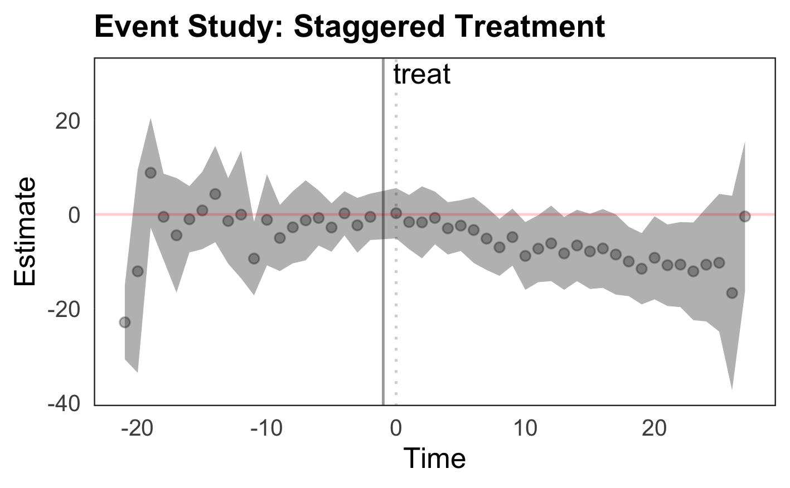

INTRODUCTION 

A Difference-in-Difference (DID) event study, or a Dynamic DID model, is a useful tool in evaluating treatment effects of the pre- and post- treatment periods in your respective study. However, since treatment can be staggered - where the treatment group are treated at different time periods - it might be challenging to create a clean event study.

In the following code, we will learn how to create a DID event study when treatment is staggered. If there is only one treatment period, the same methodology as described below can be applied.  

###What is an event study with respect to DID? 

Mechanically, an event study is a graphical illustration of the point estimates and confidence intervals of the regression for each time period before and after the treatment period. It's further relevant in the DID environment as the point estimates are the average mean differences between the treated and control groups, which provides further evidence of the credibility in assuming parallel trends. A great resource for learning more about DID and event study theory is at [Causal Inference: The Mixtape](https://mixtape.scunning.com/difference-in-differences.html#providing-evidence-for-parallel-trends-through-event-studies-and-parallel-leads). 

### Data

The paper, [Clarke & Schythe (2020)](http://ftp.iza.org/dp13524.pdf), provides tools to do the event study in STATA, which in this page I apply to R. The data used in the event study below is the same used in [Clarke & Schythe (2020)](http://ftp.iza.org/dp13524.pdf), which originates from [Stevenson and Wolfers (2006)](http://users.nber.org/~jwolfers/papers/bargaining_in_the_shadow_of_the_law.pdf). This data is a balanced panel from 1964 through 1996 of the United States no-fault divorce reforms and female suicide rates. This data has been used in other papers, such as [Goodman-Bacon (2018)](https://www.nber.org/papers/w25018). You can directly download the data [here](http://www.damianclarke.net/stata/bacon_example.dta). 

## The Regression

We will be estimating the following model: 

$$ 
asmrs_{st} = \alpha + \Sigma_{k=-21}^{-2}\beta_kI(lag_k)*treat_s+\Sigma_{k=0}^{27}\beta_kI(lead_k)*Treat_s+ X'_{st}\Gamma+\phi_s+\gamma_t+\epsilon_{st}
$$

 - $I(lag_k)$ is a dummy variable, equaling 1 if the observation's `year_to_treat` is the same value as `k`; 0 otherwise. $I(lead_k)$ is analogous to $I(lag_k)$. 
 
 - $Treat_s=1$ if the state is treated, 0 otherwise. This allows to compare the difference in means at each time period between the treated and the control. 
 
 - The controls, $X`$, are the following: `pcinc`, `asmrh`, `cases` 
 
 - $\phi$ and $\gamma$ are state and time fixed effects 
 
 - Further, the standard errors will be clustered at the state level 


Important notes on the regression

- The point of the regression is to show for each period before and after treatment that the coefficients on the pre-treated periods are statistically insignificant

- Showing the control and treated groups are statistically the same ($\beta=0$) supports, though does not prove, the parallel trends assumption in DID estimation.

In most event studies, the -1 time lag is used as the reference (or dropped from the regression). You can see in the model specification below that the first summation is from the "earliest" period, $k=-21$ to $k=-2$, and the second summation from $k=0$ to $k=27$. 


# R 

First, load packages and the data 

```r
library(pacman)
p_load(dplyr, fixest, tidyverse, broom, fastDummies, haven)

#Load data
bacon_df <- read_dta("https://raw.githubusercontent.com/LOST-STATS/LOST-STATS.github.io/master/Model_Estimation/Data/bacon_example.dta"))
```

## Manipulate Data 

Before we can run the regression or create the graphs, we need to edit and mutate the data. 

```r
bacon_df = bacon_df %>%
  mutate(
  #create the lag/lead for treated states
  #fill in control obs with 0
  time_to_treat =ifelse(is.na(`_nfd`),0,year - `_nfd`),
  #this will determine the difference
  #btw controls and treated states 
  treat = ifelse(is.na(`_nfd`),0,1)
  )
```

A few notes on the code:  

- Column `_nfd` in the data  specifies the year in which the law went into effect for the respective state. We use this column to identify the lead and lags with respect to year of treatment.

- Note that there are some states in which `_nfd` is empty. These states never received treatment, and thus exist as a control. 

- To ensure the control observations are contained in the event study, it's important to fill in the the `time_to_treat` observations with 0s. This allows for the interaction between `treat` and `time_to_treat` to occur for each state. Otherwise, there may be some NAs and the estimations will be off.  
    - To illustrate this, run the code and analyze `time_to_treat`. 
    - You should see a sequence of negative and positive numbers between -21 and 27 for each state.
    - States that were never treated will only have 0s.
    - What this means is that if a state, say State A, is treated in 1970, then in the `time_to_treat` column, for each year before 1970, the values will be -14,-13,...,-1.
    - Thus, in 1970, the value in `time_to_treat` is 0.

This is important because in the regression we want to compare for each state the mean values in each period before and after treatment. 

Further, if you're interested in creating a dummy variable for each lead/lag in your data set, you can use the package `fastDummies`. The code to use is the following: 

`bacon_df =dummy_cols(bacon_df, select_column = "time_to_treat")`


In this study, we don't need to mutate the dataframe with individual dummies for each lead/lag value.  However, in the case you would like to, the `dummy_cols` function makes it effortless to create multiple dummies from a single or multiple columns. 


## Regression

There are many ways to run a regression in R. Note the following: 

- The regression here will use `feols()` from the `fixest` package.

- In the regression, we create the dummy variables by using `i()`, highlighting the interaction between **treat** and **time_to_treat** with ref=-1. 

- One of the reasons `feols` is powerful is that it is quick, and allows the researcher to create fixed effects (FEs) and clusters seamlessly. 

- The `tidy()` function wraps the regression in order to create a dataframe and easily estimate the confidence intervals. **This is key** as it makes creating the plot much easier. 

- Lastly, create a new column in the regression data.frame of the years. This way you're not plotting the coefficient name (which is clunky).  

#### Regression Code 

```r
event_1 = tidy(feols(asmrs ~  i(treat, time_to_treat, ref=-1) + pcinc + asmrh + cases| stfips + year, cluster=~stfips, data=bacon_df), conf.int = T) %>% mutate(year =  as.numeric(parse_number(term)))
```

### Plots 

In the next two sections, I will show how you can create two types of event study graphs

- Confidence Interval Lines
- Confidence Interval Ribbon

Some notes on the code for the two graphs:  

- Because the regression table includes the coefficients for the controls, you can directly filter those coefficients out of `event_1` by using `filter(!is.na(year))`. 

- The `tidy()` allows you to create confidence intervals with the `conf.low` and `conf.high` estimates.  In the examples below, I used `geom_pointrange` and `geom_ribbon` to showcase the intervals. 

- `ggplot` provides multiple ways to customize the graph. I've included a version of what I personally like. Change up the code to meet your preferences. 

- Further, I added specific lines to highlight $y=0$, $time=0$, and $time=-1$ to communicate the pre- and post-trends. 

### Confidence Interval Lines


To recreate the graph, use the following code: 

```r

event_1 %>% filter(!is.na(year)) %>%
    ggplot(mapping = aes(x = year, y = estimate, ymin = conf.low,
         ymax = conf.high))+
             geom_pointrange(position = position_dodge(width = 1), color="black", fatten=.5, alpha=.8) +
#all the code below is customizable
             geom_hline(yintercept=0, color = "red",alpha=0.2)+
             geom_vline(xintercept = -1, 
                color = "black", size=0.5, alpha=0.4) +
             geom_vline(xintercept = 0, linetype="dotted", 
                color = "black", size=0.5, alpha=0.2)+
  theme_bw()+
  theme(
    plot.title = element_text(face = "bold", size = 12),
    legend.background = element_rect(fill = "white", size = 4, colour = "white"),
    legend.justification = c(0, 1),
    legend.position = c(0, 1),
    axis.ticks = element_line(colour = "white", size = 0.1),
    panel.grid.major = element_line(colour = "white", size = 0.07),
    panel.grid.minor = element_blank()
  )+
    annotate("text", x = c(0,2), y=30, label = c("","treat"))+
     labs(title="Event Study: Staggered Treatment", y="Estimate", x="Time")
```


### Confidence Interval (CI) Ribbon 

- Use `geom_ribbon` to show the area of the confidence interval and `geom_point` in the ggplot to show the point estimates. 

- If you wanted to combine both the `geom_ribbon` with `geom_pointrange` that is another possibility. 

- The only difference in this subsequent graph is the `geom_ribbon` and `geom_point` functions. 



```r
event_1 %>% filter(!is.na(year)) %>%
    ggplot(mapping = aes(x = year, y = estimate))
    +geom_ribbon(aes(ymin=conf.low, ymax=conf.high) ,fill="gray", alpha=1) +
             geom_point(alpha=0.3, fill="black")+
#all the code below is customizable
             geom_hline(yintercept=0, color = "red",alpha=0.2)+
             geom_vline(xintercept = -1, 
                color = "black", size=0.5, alpha=0.4) +
             geom_vline(xintercept = 0, linetype="dotted", 
                color = "black", size=0.5, alpha=0.2)+
  theme_bw()+
  theme(
    plot.title = element_text(face = "bold", size = 12),
    legend.background = element_rect(fill = "white", size = 4, colour = "white"),
    legend.justification = c(0, 1),
    legend.position = c(0, 1),
    axis.ticks = element_line(colour = "white", size = 0.1),
    panel.grid.major = element_line(colour = "white", size = 0.07),
    panel.grid.minor = element_blank()
  )+
    annotate("text", x = c(0,2), y=30, label = c("","treat"))+
   labs(title="Event Study: Staggered Treatment", y="Estimate", x="Time")
```
