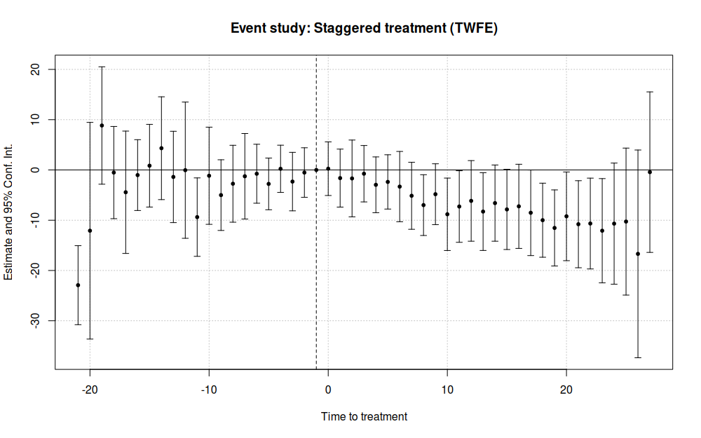
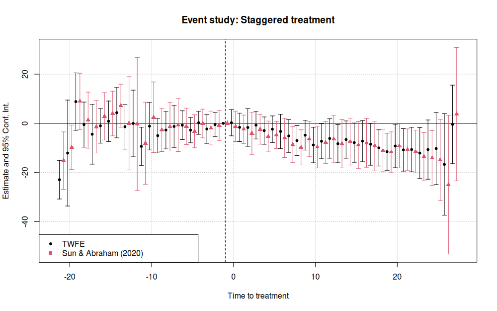

# Difference-in-Differences Event Study / Dynamic Difference-in-Differences

A Difference-in-Difference (DID) event study, or a Dynamic DID model, is a useful tool in evaluating treatment effects of the pre- and post- treatment periods in your respective study. However, since treatment can be staggered --- where the treatment group are treated at different time periods --- it might be challenging to create a clean event study. We will try to address these issues explicitly in the implementation examples that follow.

**Important:** The dataset used for the implementation examples on this page derives from a staggered treatment ("rollout") design. Various studies have shone a light on the potential biases that can result from applying a standard, twoway fixed-effect (TWFE) regression estimator on such a staggered setup, including [Sun and Abraham (2020)](https://www.sciencedirect.com/science/article/pii/S030440762030378X), [Callaway and Sant'Anna (2020)](https://www.sciencedirect.com/science/article/pii/S0304407621001445#b18), and [Goodman-Bacon (2021)](https://www.sciencedirect.com/science/article/pii/S0304407621001445). Where possible, we will highlight these issues and provide code examples that addresses the potential baises. Note that in cases where the rollout is _not_ staggered (i.e. there is only one treatment period), the same approaches can be applied without loss.

The regression that DID event studies are based aroud is:

$$
Y_{gt} = \alpha + \Sigma_{k=T_0}^{-2}\beta_k\times treat_{gk}+\Sigma_{k=0}^{T_1}\beta_k\times treat_{gk}+ X_{st}\Gamma+\phi_s+\gamma_t+\epsilon_{st}
$$

Where:

 - $$treat_{sk}$$ is a dummy variable, equaling 1 if the observation's periods relative to the group $$g$$'s first treated period is the same value as `k`; 0 otherwise (and 0 for all never-treated groups).

 - $$T_0$$ and $$T_1$$ are the lowest and highest number of leads and lags to consider surrouning the treatment period, respectively.

 - $$X`$$ are controls

 - $$\phi$$ and $$\gamma$$ are state and time fixed effects

 - Estimation is generally performed with standard errors clustered at the group level

Important notes on the regression:

- The point of the regression is to show for each period before and after treatment that the coefficients on the pre-treated periods are statistically insignificant

- Showing the control and treated groups are statistically the same before treatment ($$\beta_k=0$$ for $$k < 0$$) supports, though does not prove, the parallel trends assumption in DID estimation.

- One of the time periods must be dropped to avoid perfect multicollinearity (as in most fixed-effects setups). In most event studies, the -1 time lag is used as the dropped reference.

## Keep in Mind

Mechanically, an event study is a graphical illustration of the point estimates and confidence intervals of the regression for each time period before and after the treatment period. It's especially relevant in the DID environment as the point estimates are the average mean differences between the treated and control groups, which provides further evidence of the credibility in assuming parallel trends.

## Also Consider

- [2x2 Difference-in-Differences]({{ "/Model_Estimation/Research_Design/two_by_two_difference_in_difference.html" | relative_url }})
- A great resource for learning more about DID and event study theory is at [Causal Inference: The Mixtape](https://mixtape.scunning.com/difference-in-differences.html#providing-evidence-for-parallel-trends-through-event-studies-and-parallel-leads).

# Implementations

All implementations use the same data, which comes from [Stevenson and Wolfers (2006)](http://users.nber.org/~jwolfers/papers/bargaining_in_the_shadow_of_the_law.pdf) by way of [Clarke & Schythe (2020)](http://ftp.iza.org/dp13524.pdf), who use it as an example to demonstrate Goodman-Bacon effects. This data is a balanced panel from 1964 through 1996 of the United States no-fault divorce reforms and female suicide rates. You can directly download the data [here](http://www.damianclarke.net/stata/bacon_example.dta).

Column `_nfd` in the data  specifies the year in which the law went into effect for the respective state. We use this column to identify the lead and lags with respect to year of treatment. `pcinc`, `asmrh`, and `cases` are controls. Again, it is important to emphasise that treatment (i.e. when the law went into effect for each state) is staggered over time.

Note that there are some states in which `_nfd` is empty. These states never received treatment, and thus exist as a control.

## Python

Python makes dealing with lots of interaction terms like we have here a little painful, but we can iterate to do a lot of the work for us.

```python?example=pyevent
import pandas as pd
import linearmodels as lm

# Read in data
df = pd.read_csv("https://raw.githubusercontent.com/LOST-STATS/LOST-STATS.github.io/master/Model_Estimation/Data/Event_Study_DiD/bacon_example.csv")

# create the lag/lead for treated states
# fill in control obs with 0
# This allows for the interaction between `treat` and `time_to_treat` to occur for each state.
# Otherwise, there may be some missingss and the estimations will be off.
df['time_to_treat'] = (
    df['_nfd'].sub(df['year'])
        # missing values for _nfd implies no treatment
        .fillna(0)
        # so we don't have decimals in our factor names
        .astype('int')
)

# Create our interactions by hand,
# skipping -1, the last one before treatment

df = (
    # returns dataframe with dummy columns in place of the columns
    # in the named argument, all other columns untouched
    pd.get_dummies(df, columns=['time_to_treat'], prefix='INX')
      # Be sure not to include the minuses in the name
      .rename(columns=lambda x: x.replace('-', 'm'))
      # get_dummies has a `drop_first` argument, but if we want to
      # refer to a specific level, we should return all levels and
      # drop out reference column manually
      .drop(columns='INX_m1')
      # Set our individual and time (index) for our data
      .set_index(['stfips', 'year'])
)

# Estimate the regression

scalars = ['pcinc', 'asmrh', 'cases']
factors = df.columns[df.columns.str.contains('INX')]
exog = factors.union(scalars)
endog = 'asmrs'

# with the standard api:
mod = lm.PanelOLS(df[endog], df[exog], entity_effects=True, time_effects=True)
fit = mod.fit(cov_type='clustered', cluster_entity=True)
fit.summary

# with the formula api:
# We can save ourselves some time by creating the regression formula automatically
inxnames = df.columns[range(13,df.shape[1])]
formula = '{} ~ {} + EntityEffects + TimeEffects'.format(endog, '+'.join(exog))

mod = lm.PanelOLS.from_formula(formula,df)

# Specify clustering when we fit the model
clfe = mod.fit(cov_type = 'clustered',
    cluster_entity = True)

# Look at regression results
clfe.summary
```

Now we can plot the results with **matplotlib**. Two common approaches are to include vertical-line confidence intervals with `errorbar()` or to include a confidence interval ribbon with `fill_between()`. I'll show the `errorbar()` version.

```python?example=pyevent
# Get coefficients and CIs
res = pd.concat([clfe.params, clfe.std_errors], axis = 1)
# Scale standard error to 95% CI
res['ci'] = res['std_error']*1.96

# We only want time interactions
res = res.filter(like='INX', axis=0)
# Turn the coefficient names back to numbers
res.index = (
    res.index
        .str.replace('INX_', '')
        .str.replace('m', '-')
        .astype('int')
        .rename('time_to_treat')
)

# And add our reference period back in, and sort automatically
res.reindex(range(res.index.min(), res.index.max()+1)).fillna(0)

# Plot the estimates as connected lines with error bars

ax = res.plot(
    y='parameter',
    yerr='ci',
    xlabel='Time to Treatment',
    ylabel='Estimated Effect',
    legend=False
)
# Add a horizontal line at 0
ax.axhline(0, linestyle='dashed')
# And a vertical line at the treatment time
# some versions of pandas have bug return x-axis object with data_interval
# starting at 0. In that case change 0 to 21
ax.axvline(0, linestyle='dashed')
```

Which produces:


Of course, as earlier mentioned, this analysis is subject to the critique by Sun and Abraham (2020). You want to calculate effects separately by time-when-treated, and then aggregate to the time-to-treatment level properly, avoiding the way these estimates can "contaminate" each other in the regular model. You are on your own for this process in Python, though. Read the paper (and the back-end code from the R or Stata implementations listed below).

## R

A variety of R packages can be used to conduct event-study DiD analysis. Here we will use **fixest**, which is both extremely fast and provides several convenience features (including ES graphics and implementation of the Sun-Abraham method). Note that we are using version 0.9.0 of **fixest**.

```r?example=event_study
library(data.table) ## For some minor data wrangling
library(fixest)     ## NB: Requires version >=0.9.0

# Load and prepare data
dat = fread("https://raw.githubusercontent.com/LOST-STATS/LOST-STATS.github.io/master/Model_Estimation/Data/Event_Study_DiD/bacon_example.csv") 

# Let's create a more user-friendly indicator of which states received treatment
dat[, treat := ifelse(is.na(`_nfd`), 0, 1)]

# Create a "time_to_treatment" variable for each state, so that treatment is
# relative for all treated units. For the never-treated (i.e. control) units,
# we'll arbitrarily set the "time_to_treatment" value at 0. This value 
# doesn't really matter, since it will be canceled by the treat==0 interaction
# anyway. But we do want to make sure they aren't NA, otherwise feols would drop 
# these never-treated observations at estimation time and our results will be 
# off.
dat[, time_to_treat := ifelse(treat==1, year - `_nfd`, 0)]
```

Let's run our event study model. Again, we'll be using `fixest::feols()` to do so. Note that the key time × treatment interaction takes place via the special `i()` operator. In the below case, we are essentially implementing a standard two-way fixed-effects (TWFE) procedure. We'll also specify state+year fixed effects and explicitly cluster the standard errors at the state level (although this would be done by default).

```r?example=event_study
mod_twfe = feols(asmrs ~ i(time_to_treat, treat, ref = -1) + ## Our key interaction: time × treatment status
		  pcinc + asmrh + cases |                    ## Other controls
		  stfips + year,                             ## FEs
		 cluster = ~stfips,                          ## Clustered SEs
		 data = dat)
```
While it's relatively straightforward to convert this model object into a data frame and then plot manually using **ggplot2**, this is more work than we need to do here. Specifically, **fixest** provides a convenient `iplot()` function for plotting the interaction term coefficients from a model. The resulting plot can be heavily customized, but for event-study designs it generally does exactly what you'd want out of the box.

```r?example=event_study
iplot(mod_twfe, 
      xlab = 'Time to treatment',
      main = 'Event study: Staggered treatment (TWFE)')
```

This results in:



As earlier mentioned, the standard TWFE approach to event studies is subject to various problems in the presence of staggered treatment rollout. Fortunately, **fixest** provides the `sunab()` convenience function for estimating the aggregated "cohort" method proposed by Sun and Abraham (2020). In the below example, the only material change is to swap out the `i()` interaction with the `sunab()` equivalent.

```r?example=event_study
# Following Sun and Abraham, we give our never-treated units a fake "treatment"
# date far outside the relevant study period.
dat[, year_treated := ifelse(treat==0, 10000, `_nfd`)]

# Now we re-run our model from earlier, but this time swapping out 
# `i(time_to_treat, treat, ref = -1)` for `sunab(year_treated, year)`.
# See `?sunab`.
mod_sa = feols(asmrs ~ sunab(year_treated, year) + ## The only thing that's changed
	        pcinc + asmrh + cases |
		stfips + year,
	       cluster = ~stfips,
	       data = dat)
```
Again, we can use `iplot()` to depict the resulting event study in graphical form. In this case, we'll plot both the new Sun-Abraham mode results and the previous (naive) TWFE model results

```r?example=event_study
iplot(list(mod_twfe, mod_sa), sep = 0.5, ref.line = -1,
      xlab = 'Time to treatment',
      main = 'Event study: Staggered treatment')
legend("bottomleft", col = c(1, 2), pch = c(20, 17), 
       legend = c("TWFE", "Sun & Abraham (2020)"))
```


## Stata

We can use the **reghdfe** package to help with our two-way fixed effects and high-dimensional data. Install with `ssc install reghdfe` first if you don't have it.

```stata
use "https://raw.githubusercontent.com/LOST-STATS/LOST-STATS.github.io/master/Model_Estimation/Data/Event_Study_DiD/bacon_example.dta", clear

* create the lag/lead for treated states
* fill in control obs with 0
* This allows for the interaction between `treat` and `time_to_treat` to occur for each state.
* Otherwise, there may be some NAs and the estimations will be off.
g time_to_treat = year - _nfd
replace time_to_treat = 0 if missing(_nfd)
* this will determine the difference
* btw controls and treated states
g treat = !missing(_nfd)

* Stata won't allow factors with negative values, so let's shift
* time-to-treat to start at 0, keeping track of where the true -1 is
summ time_to_treat
g shifted_ttt = time_to_treat - r(min)
summ shifted_ttt if time_to_treat == -1
local true_neg1 = r(mean)

* Regress on our interaction terms with FEs for group and year,
* clustering at the group (state) level
* use ib# to specify our reference group
reghdfe asmrs ib`true_neg1'.shifted_ttt pcinc asmrh cases, a(stfips year) vce(cluster stfips)
```

Now we can plot.

```stata
* Pull out the coefficients and SEs
g coef = .
g se = .
levelsof shifted_ttt, l(times)
foreach t in `times' {
	replace coef = _b[`t'.shifted_ttt] if shifted_ttt == `t'
	replace se = _se[`t'.shifted_ttt] if shifted_ttt == `t'
}

* Make confidence intervals
g ci_top = coef+1.96*se
g ci_bottom = coef - 1.96*se

* Limit ourselves to one observation per quarter
* now switch back to time_to_treat to get original timing
keep time_to_treat coef se ci_*
duplicates drop

sort time_to_treat

* Create connected scatterplot of coefficients
* with CIs included with rcap
* and a line at 0 both horizontally and vertically
summ ci_top
local top_range = r(max)
summ ci_bottom
local bottom_range = r(min)

twoway (sc coef time_to_treat, connect(line)) ///
	(rcap ci_top ci_bottom time_to_treat)	///
	(function y = 0, range(time_to_treat)) ///
	(function y = 0, range(`bottom_range' `top_range') horiz), ///
	xtitle("Time to Treatment") caption("95% Confidence Intervals Shown")
```

Which produces:


Any further decoration or theming at that point is up to you.

Of course, as earlier mentioned, this analysis is subject to the critique by Sun and Abraham (2020). We can estimate the Sun and Abraham method using the **eventstudyinteract** command in Stata. Install by installing the **github** package with `net install github, from("https://haghish.github.io/github/")` and then installing **eventstudyinteract** with `github install lsun20/eventstudyinteract`.

See `help eventstudyinteract` for more information.

```stata
* Reload our data since we squashed it to graph
use "https://raw.githubusercontent.com/LOST-STATS/LOST-STATS.github.io/master/Model_Estimation/Data/Event_Study_DiD/bacon_example.dta", clear

* create the lag/lead for treated states
* fill in control obs with 0
* This allows for the interaction between `treat` and `time_to_treat` to occur for each state.
* Otherwise, there may be some NAs and the estimations will be off.
g time_to_treat = year - _nfd
replace time_to_treat = 0 if missing(_nfd)
* this will determine the difference
* btw controls and treated states
g treat = !missing(_nfd)
g never_treat = missing(_nfd)


* Create relative-time indicators for treated groups by hand
* ignore distant leads and lags due to lack of observations
* (note this assumes any effects outside these leads/lags is 0)
tab time_to_treat
forvalues t = -9(1)16 {
	if `t' < -1 {
		local tname = abs(`t')
		g g_m`tname' = time_to_treat == `t'
	}
	else if `t' >= 0 {
		g g_`t' = time_to_treat == `t'
	}
}

eventstudyinteract asmrs g_*, cohort(_nfd) control_cohort(never_treat) covariates(pcinc asmrh cases) absorb(i.stfips i.year) vce(cluster stfips)

* Get effects and plot
* as of this writing, the coefficient matrix is unlabeled and so we can't do _b[] and _se[]
* instead we'll work with the results table
matrix T = r(table)
g coef = 0 if time_to_treat == -1
g se = 0 if time_to_treat == -1
forvalues t = -9(1)16 {
	if `t' < -1 {
		local tname = abs(`t')
		replace coef = T[1,colnumb(T,"g_m`tname'")] if time_to_treat == `t'
		replace se = T[2,colnumb(T,"g_m`tname'")] if time_to_treat == `t'
	}
	else if `t' >= 0 {
		replace coef =  T[1,colnumb(T,"g_`t'")] if time_to_treat == `t'
		replace se = T[2,colnumb(T,"g_`t'")] if time_to_treat == `t'
	}
}

* Make confidence intervals
g ci_top = coef+1.96*se
g ci_bottom = coef - 1.96*se

keep time_to_treat coef se ci_*
duplicates drop

sort time_to_treat
keep if inrange(time_to_treat, -9, 16)

* Create connected scatterplot of coefficients
* with CIs included with rcap
* and a line at 0 both horizontally and vertically
summ ci_top
local top_range = r(max)
summ ci_bottom
local bottom_range = r(min)

twoway (sc coef time_to_treat, connect(line)) ///
	(rcap ci_top ci_bottom time_to_treat)	///
	(function y = 0, range(time_to_treat)) ///
	(function y = 0, range(`bottom_range' `top_range') horiz), ///
	xtitle("Time to Treatment with Sun and Abraham (2020) Estimation") caption("95% Confidence Intervals Shown")
```
