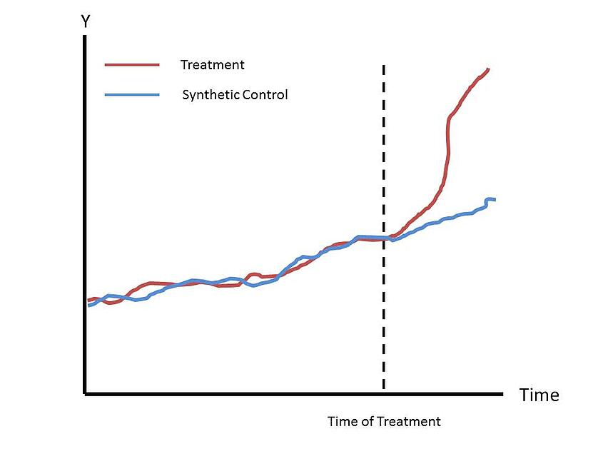

# Synthetic Control Method (SCM)

Synthetic Control Method is a way of estimating the causal effect of an intervention in comparative case studies. It is typically used with a small number of large units (e.g. countries, states, counties) to estimate the effects of aggregate interventions. The idea is to construct a convex combination of similar untreated units (often referred to as the "donor pool") to create a synthetic control that closely resembles the treatment subject and conduct counterfactual analysis with it.

If we have $$j = 1, 2, ..., J+1$$ units, without loss of generality, assume the first unit is the treated unit, $$Y_{1t}$$. Denoting the potential outcome without intervention as $$Y_{1t}^N$$, our goal is to estimate the treatment effect: 

$$
\tau_{1t} = Y_{1t} - Y_{1t}^N
$$

We won't have data for $$Y_{1t}^N$$ but we can use synthetic controls to estimate it. 

Let the $$k$$ x $$J$$ matrix $$X_0 = [X_2 ... X_{J+1}]$$ represent characteristics for the untreated units and the $$k$$-length vector $$X_1$$ represent characteristics for the treatment unit. Last, define our $$J$$ x $$1$$ vector of weights as $$W = (w_2, ..., w_{J+1})'$$. Recall, these weights are used to form a convex combination of the untreated units. Now we have our estimate for the treatment effect: 

$$
\hat{\tau_{1t}} = Y_{1t} - \hat{Y_{1t}^N}
$$

where $$\hat{Y_{1t}^N} = \sum_{j=2}^{J+1} w_j Y_{jt}$$.

The matrix of weights is found by choosing $$W*$$ to minimize 
$$
\|X_1 - X_0W\|
$$ 
such that $$W >> 0$$ and $$\sum_2^{J+2} w_j = 1$$.

Once you've found the $$W*$$, you can put together an estimated $$\hat{Y_{1t}}$$ (synthetic control) for all time periods $$t$$. Because our synthetic control was constructed from untreated units, when the intervention occurs at time $$T_0$$, the difference between the synthetic control and the treated unit gives us our estimated treatment effect.

As a last bit of intuition, below is a graph depicting the upshot of the method. The synthetic control follows a very similar path to the treated unit pre-intervention. The difference between the two curves, post-intervention, gives us our estimated treatment effect. 


[Here](https://economics.mit.edu/files/17847) is an excellent resource by Alberto Abadie (the economist who developed the method) if you're interested in getting a more comprehensive overview of synthetic controls.

## Keep in Mind

- Unlike the [difference-in-difference](https://lost-stats.github.io/Model_Estimation/Research_Design/two_by_two_difference_in_difference.html) method, parallel trends aren't a necessary assumption, however, the donor pool must still share similar characteristics to the treatment unit in order to construct an accurate estimate.
- Panel data is necessary for synthetic control method and, typically, requires observations over many time periods. Specifically, the pre-intervention time frame ought to be large enough to form an accurate estimate.
- Aggregate data is required for this method. Examples include state-level per-capita GDP, country-level crime rates, and state-level alcohol consumption statistics. Additionally, if aggregate data doesn't exist, you can sometimes aggregate micro-level data to estimate aggregate values.
- As a caveat to the previous bullet point, be wary of structural breaks when using large pre-intervention periods. 

## Also Consider

- As stated before, this technique can be compared to [difference-in-difference](https://lost-stats.github.io/Model_Estimation/Research_Design/two_by_two_difference_in_difference.html). If you don't have aggregate data or don't have sufficient data for the pre-intervention window and you have a control that you can confidently assume has a parallel trend to the treatment unit, then diff-in-diff might be better suited than SCM.
- INCLUDE LINKS TO OTHER LOST PAGES WITH THE FORMAT [Description]({{ "/Category/page.html" | relative_url }}). Categories include Data_Manipulation, Geo-Spatial, Machine_Learning, Model_Estimation, Presentation, Summary_Statistics, Time_Series, and Other, with subcategories at some points. Check the URL of the page you want to link to on [the published site](https://lost-stats.github.io/).

# Implementations

## R

To implement the synthetic control method in R, we will be using the package [Synth](https://cran.r-project.org/web/packages/Synth/Synth.pdf). As stated above, the key part of the synthetic control method is to estimate the weight matrix $$W*$$ in order to form accurate estimates of the treatment unit. The Synth package provides you with the tools to find the weight matrix. From there, you can construct the synthetic control by interacting the $$W*$$ and the $Y$ values from the donor pool.

```r
# First we will load Synth and dplyr.
# If you haven't already installed Synth, now would be the time to do so

library(dplyr, Synth)

# We're going to use simulated data included in the Synth package for our example.
# This dataframe consists of panel data including 1 outcome variable and 3 predictor variables for 1 treatment unit and 7 control units (donor pool) over 21 years

data("synth.data")

# The primary function that we will use is the synth() function.
# However, this function needs four particularly formed matrices as inputs, so it is highly recommended that you use the dataprep() function to generate the inputs.
# Once we've gathered our dataprep() output, we can just use that as our sole input for synth() and we'll be good to go.
# One important note is that your data must be in long format with id variables (integers) and name variables (character) for each unit.

dataprep_out = dataprep(
  foo = synth.data, # first input is our data
  predictors = c("X1", "X2", "X3"), # identify our predictor variables
  predictors.op = "mean", # operation to be performed on the predictor variables for when we form our X_1 and X_0 matrices.
  time.predictors.prior = c(1984:1989), # pre-intervention window
  dependent = "Y", # outcome variable
  unit.variable = "unit.num", # identify our id variable
  unit.names.variable = "name", # identify our name variable
  time.variable = "year", # identify our time period variable
  treatment.identifier = 7, # integer that indicates the id variable value for our treatment unit
  controls.identifier = c(2, 13, 17, 29, 
                          32, 36, 38), # vector that indicates the id variable values for the donor pool
  time.optimize.ssr = c(1984:1990), # identify the time period you want to optimize over to find the W*. Includes pre-treatment period and the treatment year.
  time.plot = c(1984:1996) # periods over which results are to be plotted with Synth's plot functions
)

# Now we have our data ready in the form of a list. We have all the matrices we need to run synth()
# Our output from the synth() function will be a list that includes our optimal weight matrix W*

synth_out = dataprep_out %>% synth()

# From here, we can plot the treatment variable and the synthetic control using Synth's plot function

synth_out %>% path.plot(dataprep.res = dataprep_out, tr.intake = 1990)

# Finally, we can construct our synthetic control variable if we wanted to conduct difference-in-difference analysis on it to estimate the treatment effect.

synth_control = dataprep_out$Y0plot %*% synth_out$solution.w

```

