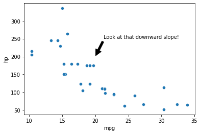
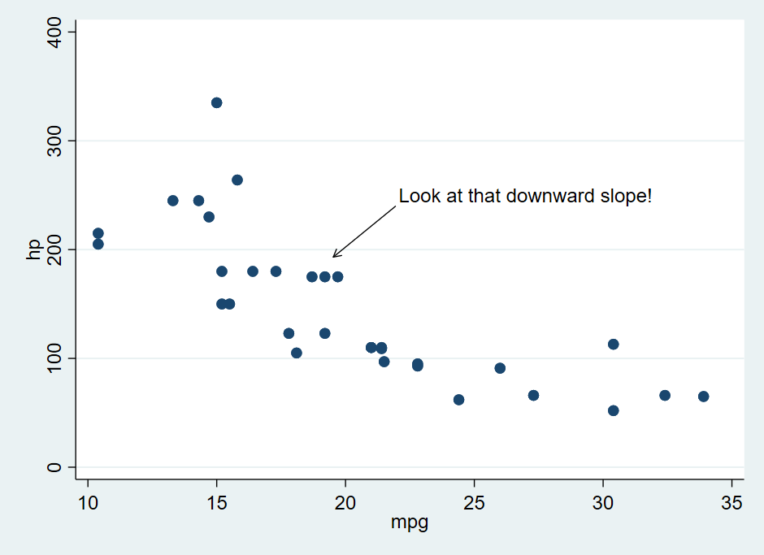

# Graph Annotations

In general, data visualization should be capable of clearly demonstrating something about the underlying data. In many cases, that demonstration can be made clearer by adding annotations to the graph. These could be text annotations that emphasize the point being made, arrows that direct the eye to particularly interesting data, or other things.

This page will demonstrate how to add text and arrow annotations to graphs. Typically, other types of annotations can be added using nearly the same steps - see the relevant documentation, or look for other buttons in cases where point-and-click systems are used.

## Keep in Mind

- Annotations directly on the graph are generally best used to emphasize data or help clarify the point being made. Technical details are often better placed in a caption below the graph.
- The ideal placement of annotations is often sensitive to the size of the graph. You often want to place an annotation in a spot where it's not blocking anything, but in a smaller graph that's going to be a different area than on a bigger graph. So decide, before adding your annotations, the size you're going to export your graph at.

## Also Consider

- Working with text descriptions on the graph axes with [Formatting Graph Axes]({{ "/Presentation/Figures/formatting_graph_axes.html" | relative_url }}).

# Implementations

## Python

In **matplotlib.pyplot** package, the `.text()` and `.annotate()` methods, which can follow a properly-created graph (from **matplotlib** or **seaborn**, which is used here) can be used to add an annotation without, or with, an arrow.

```python
import matplotlib.pyplot as plt
import seaborn as sns
# Just for the mtcars data
import statsmodels.datasets as smd
mtcars = smd.get_rdataset('mtcars').data

# Scatterplot
sns.scatterplot(x='mpg', y = 'hp', data = mtcars)

# Use .text() to add a basic text label at coordinates x and y
# Here I use horizontalalignment = 'center' to more easily pick the coordinates
plt.text(x=27, y=250, s='Look at that downward slope!', horizontalalignment = 'center')

# Alternately, use .annotate() to add both a text label and also an arrow
# Note separate coordinates for the text (xytext) and for the target point of the arrow (xy)
sns.scatterplot(x='mpg', y = 'hp', data = mtcars)
plt.annotate('Look at that downward slope!', xy = (20, 200),
             xytext = (27, 250), horizontalalignment = 'center',
             arrowprops=dict(facecolor='black', shrink=0.05))
```	

		 

## R

We'll be using the `annotate()` function to add annotations to a **ggplot2** graph.

```r
library(tidyverse)
data(mtcars)

# Make a graph
p <- ggplot(mtcars, aes(x = mpg, y = hp)) + geom_point()

# Look at what you have to figure out the appropriate coordinates to put your label
# You'll likely have to try your annotations a few times to get the coordinates correct
p

# Add text annotations with geom = 'label' or geom = 'text'
# And fill in the label with "label"
p + annotate(geom = 'text', x = 27, y = 250, label = 'Look at that downward slope!')
# label_wrap from the scales package can often come in handy here
p <- p + annotate(geom = 'text', x = 27, y = 250, label = scales::label_wrap(20)('Look at that downward slope!'))

# annotate should be compatible with most other geometries. A common one is 'segment' for lines
p <- p + annotate(geom = 'segment', x = 24, xend = 20, y = 230, yend = 200, arrow = arrow())
```

This results in:

		 

An alternate appraoch is to use `ggannotate()` from the **ggannotate** package. This package isn't on CRAN, so instead of `install.packages('ggannotate'), first install the **remotes** package and then run `remotes::install_github('MattCowgill/ggannotate')`.

```r
p2 <- ggplot(mtcars, aes(x = mpg, y = hp)) + geom_point()
ggannotate::ggannotate(p2)
# This will open up a point-and-click annotation window
```


## Stata

In Stata, the `twoway` style of graph (as well as some others, has a `text()` option we can use to add text annotations.

```stata
* Load data
import delimited using "https://vincentarelbundock.github.io/Rdatasets/csv/datasets/mtcars.csv", clear


* Specify the text coordinates with y-axis first, then x, then the label
* It may take a few tries to get the coordinates right
twoway scatter hp mpg, text(250 27 "Look at that downward slope!")
```

Another approach, and one that will allow you to easily add arrow annotations, is to use the Stata Graph Editor, which is point-and-click. After creating your graph (without annotations), click File and Start Graph Editor. In this case, the graph editor was used to add an arrow annotation.

		 
