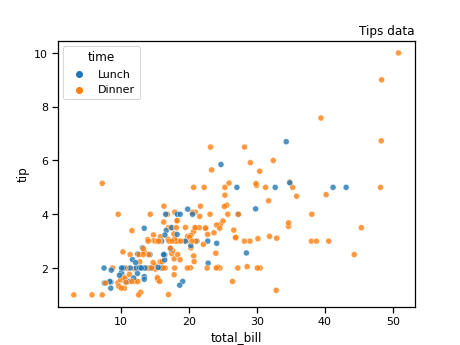
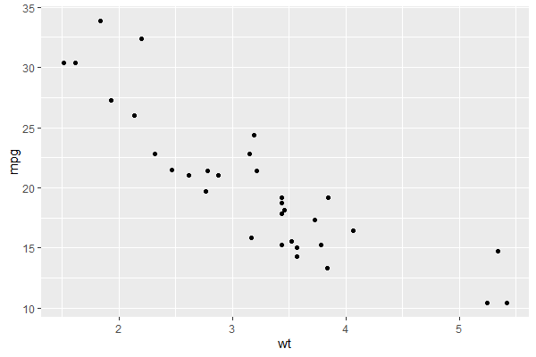
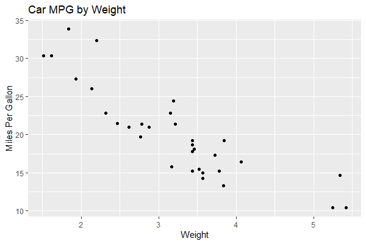
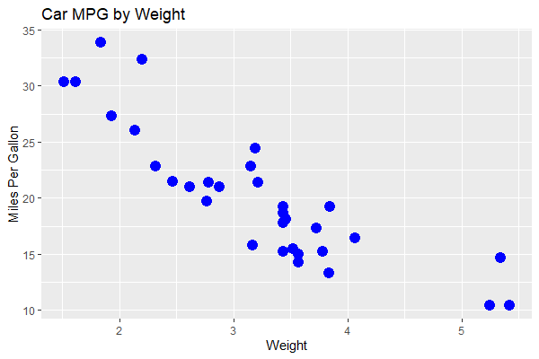

# Introduction

Scatterplots are a useful tool for visualizing data and the possible relationships present in that data. This introduction contains a brief tutorial on how to implement scatterplots, as well as some basic techniques for formatting them.

## Keep in Mind
* Scatterplots can become cluttered if there are too many datapoints or if datapoints are too large.


## Also Consider
* Scatterplots are not always the best presentation method for data. 
  * If the independent variable that is being presented is categorical or discrete, a bar graph might be a better presentation method. A guide to implementing bar graphs can be found [here]({{ "/Presentation/Figures/bar_graphs.html" | relative_url }}). 
  * If the goal is to represent distributions of continuous variables, a [histogram]({{ "/Presentation/Figures/histograms.html" | relative_url }}) would be a good option for presentation.

* Additional techniques for formatting scatterplots can by found [here]({{ "/Presentation/Figures/Styling_Scatterplots.html" | relative_url }}).


# Implementations

## Python

There are many plotting libraries in Python, covering both *imperative* (specify all of the steps to get the desired outcome) and *declarative* (specify the desired outcome without the steps) approaches. Imperative plotting gives more control and some people may find each step clearer to read, but it can also be fiddly and cumbersome, especially with simple plots. Declarative plotting trades away control in favour of tried and tested processes that can quickly produce standardised charts, but the specialised syntax can be a barrier for newcomers.

The code below shows examples of scatterplots using both methods using the declarative library [**seaborn**](https://seaborn.pydata.org/index.html), drawing from the packages' website. For imperative scatter plots, use [**matplotlib**](https://matplotlib.org/3.3.0/index.html). As usual with Python, you may need to install seaborn using `pip install seaborn` or `conda install seaborn` on the command line.

```python
import seaborn as sns

# Load the tips dataset
df = sns.load_dataset("tips")

# Plot the data. hue sets the colour of points.
# alpha sets the transparency of points. There
# are various other keyword arguments to add other
# dimensions of information too, eg size.
sns.scatterplot(data=df,
                x="total_bill",
                y="tip",
                alpha=.8,
                hue='time').set_title('Tips data', loc='right')

```

This results in:




## R
In R, one of the best tools for creating scatterplots is the function `ggplot()`, found in the `ggplot2` package. For this demonstration, we will also be using a dataset already built in to R called `mtcars`.

To begin we will need to make sure we install and load `ggplot2` as well as any other packages that are useful.

```r
#install and load necessary packages
if(!require("pacman")) install.packages("pacman")
pacman::p_load(ggplot2)

#load the dataset
data(mtcars)
```

Next, we will use `ggplot()`, `aes()`, and `geom_point()` in order to create a basic scatterplot. For this plot, we will put car weight on the x-axis and miles-per-gallon on the y-axis.

```r
#assign the mtcars dataset to the plot and set each axis
ggplot(data = mtcars,aes(x=wt,y=mpg)) +
#create points on the plot for each observation
  geom_point()
```


It is important to remember to include the + after each line when creating a plot using `ggplot()`. This + tells R that the lines of code belong together and omitting it will lead to our plot not having important parts.


Labelling is also an important task. In order to give our scatterplot axis labels and title, we will use the `labs()` function, in conjunction with our previous code. Don't forget your +'s!

```r
#assign our dataset and variables of interest to the plot
ggplot(data = mtcars, aes(x = wt, y = mpg)) +
  #create the points
  geom_point() +
  #create axis labels and a title
  labs(x = "Weight", y = "Miles Per Gallon",
       title = "Car MPG by Weight")
```


That is starting to look better, but our graph could still use a little variety to it. Next, we will learn how to change the size and color of our plot points.

* To change the size of the points in our scatterplot, we need to use the option `size`. The default size of points in `ggplot` is 1.5. We're going to make the points 4, just in case someone is having trouble seeing them.
* To change the color of our points, we will use `color`. In this example we will make our points blue.

```r
#assign our dataset and variables of interest
ggplot(data = mtcars, aes(x =wt, y = mpg)) +
  #create points and tell ggplot we want them to be size 4 and blue
  geom_point(size = 4, color = blue) +
  #don't forget the labels
  labs(x = "Weight", y = "Miles Per Gallon",
       title = "Car MPG by Weight")
```


Finally, lets label our points. We can do this by adding a new element to our plot, `geom_text()`. For this example we will label the points on our plot with their horse power. This will allow us to see how horsepower is related to weight and miles-per-gallon. We are also going to set the size of our points to 0.5 to avoid cluttering the scatterplot too much. Just like we can change the color of our points, we can change the color of the labels we put on them. We'll make them red in this example, but feel free to choose another color.

```r
#assign our dataset and variables of interest
ggplot(data = mtcars, aes(x =wt, y = mpg)) +
  #create points and tell ggplot we want them to be size 0.5 and blue
  geom_point(size = 0.5, color = 'blue') +
  #add the labels for our points
  geom_text(label = mtcars$hp, color = 'red')
  #don't forget the labels
  labs(x = "Weight", y = "Miles Per Gallon",
       title = "Car MPG by Weight")
```


Congrats!!! You're well on your way to becoming a scatterplot master! Don't forget to check out the LOST page on [styling scatterplots]({{ "/Presentation/Figures/Styling_Scatterplots.html" | relative_url }}) if you would like to learn more.
