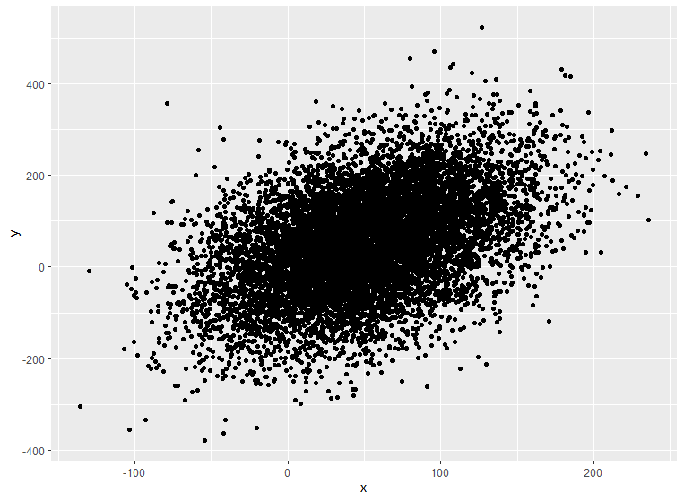
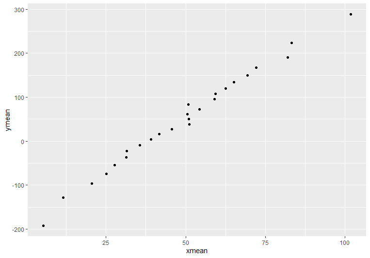
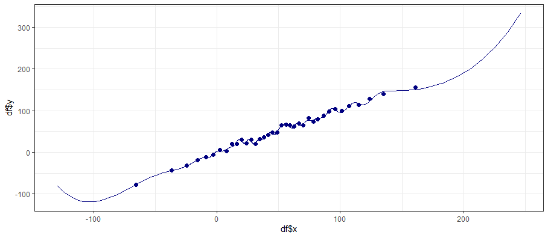
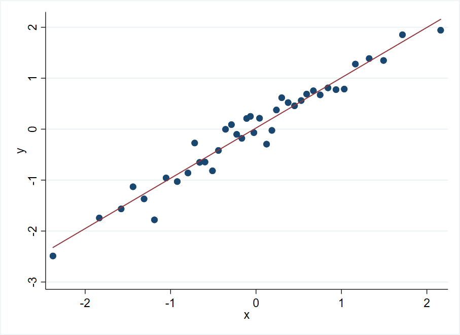
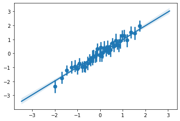

# Introduction

Binned scatterplots are a variation on scatterplots that can be useful when there are too many data points that are being plotted. Binned scatterplots take all data observations from the original scatterplot and place each one into exactly one group called a bin. Once every observation is in a bin, each bin will get one point on a scatterplot, reducing the amount of clutter on your plot, and potentially making trends easier to see visually. 

## Keep in Mind

- Bins are determined based on the conditioning variable (usually the x variable). Bin width can be determined in multiple ways. For example, you can set bin width with the goal of getting the same amount of observations into each bin. In this scenario, bins will likely all differ in width unless your data observations are equally spaced. You could also set bin width so that every bin is of equal width (and has unequal amount of observations falling into each bin).
- Once observations are placed into bins using the conditioning variable, an outcome variable (usually the y variable) is produced by aggregating all observations in the bin and using a summary statistic to obtain one single point. Possible summary statistics that can be used include mean, median, max/min, or count.
- The number of bins you will separate your data into is the most important decision you will likely make. There is no one way to determine this (the binsreg package in R has a default optimal number of bins that it calculates), but you will face the bias-variance trade off when selecting this parameter.


## Also Consider

- [Scatterplots]({{ "/Presentation/Figures/Scatterplots.html" | relative_url}})
- [Styling Scatterplots]({{ "/Presentation/Figures/Styling_Scatterplots.html" | relative_url }})
- Binned scatterplots are used frequently used in [Regression Discontinuity]({{ "/Model_Estimation/Research_Design/regression_discontinuity_design.html" | relative_url }}) 


# Implementations

## R

It is fairly straightforward to create a basic binned scatterplot in R by hand. There is also the **binsreg** package for more advanced methods that includes things like automatic bandwidth selection and nonparametric fitting of the binned data; see [here](https://towardsdatascience.com/goodbye-scatterplot-welcome-binned-scatterplot-a928f67413e4) for another example.

For the example below I will be using this created data:
```r
x = rnorm(mean=50, sd=50, n=10000)
y =  x + rnorm(mean=0, sd=100, n=10000)
df = data.frame(x=x, y=y)
```

```r
library(ggplot2)
ggplot(df, aes(x=x, y=y)) + 
  geom_point()
```



After plotting, we can see that there may be a trend, but the graph is over cluttered and not easy to interpret right away. This is when binned scatterplots are most useful.

```r
library(dplyr)

# this will create 25 quantiles using y and assign the observations in each quantile to a separate bin
df = df %>% mutate(bin = ntile(y, n=25))

new_df = df %>% group_by(bin) %>% summarise(xmean = mean(x), ymean = mean(y)) #find the x and y mean of each bin

ggplot(new_df, aes(x=xmean, y=ymean)) + 
  geom_point()

```



After binning and summarizing the data, we can identify the trend much easier! (but lose a sense of the very high variance)

Now let's use **binsreg**, which can be installed with `install.packages('binsreg')`. It will automatically select bins based on quantiles, allows you to apply control variables before plotting the residuals, and offers easy methods for fitting splines on top of the binned data with the `line` option:

```r
binsreg(df$y, df$x, line = c(3,3))
```



## Stata

Stata has the excellent user-provided package **binscatter** specifically for creating binned scatterplots, with plenty of options described in the help files.

```stata
* ssc install binscatter

* Create some data
clear
set obs 1000
g x = rnormal()
g y = x + rnormal()

* Default binscatter will plot means of y across 20 quantile-based bins of x
* And also adds a best-fit line
* Let's make 40 bins of x, why not
binscatter y x, n(40)
```



## Python

The **seaborn** package's `regplot` method offers an easy way to make a basic binned scatterplot, with a fitted line and confidence intervals for each mean.

```python
import numpy as np
import seaborn as sns

# Create random data
x = np.random.normal(size = 1000)
y = x + np.random.normal(size = 1000)

# the x_bins argument in sns.regplot lets us set bins
sns.regplot(x = x, y = y, x_bins = 40)
```



There is also a more fully-featured package **binscatterplot** that is inspired by the Stata package **binscatter** described in the Stata section here. See an example [here](https://github.com/esantorella/binscatter).
