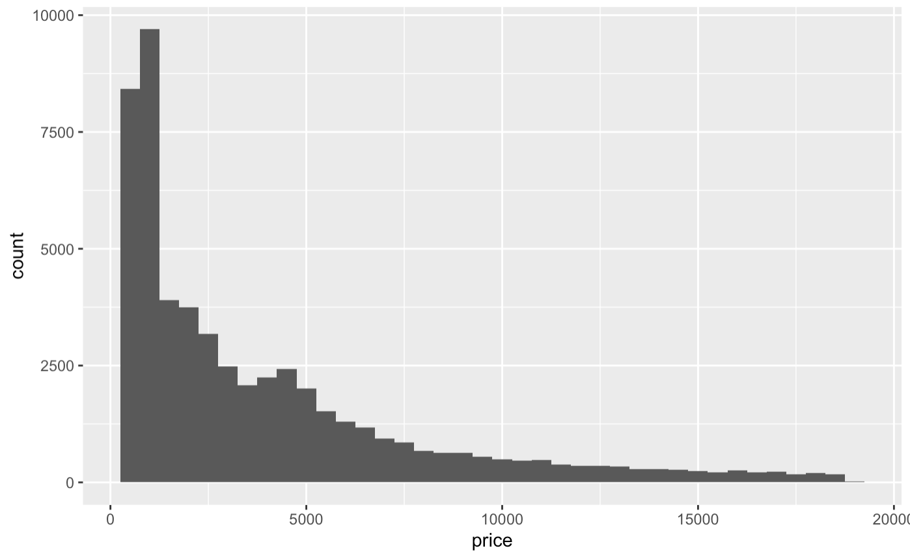
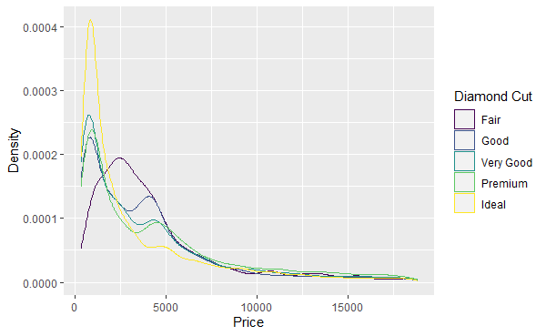
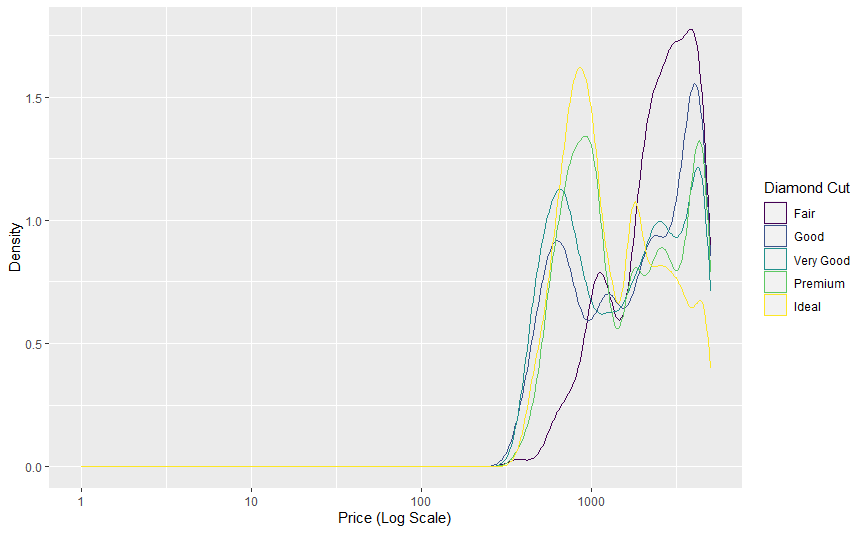
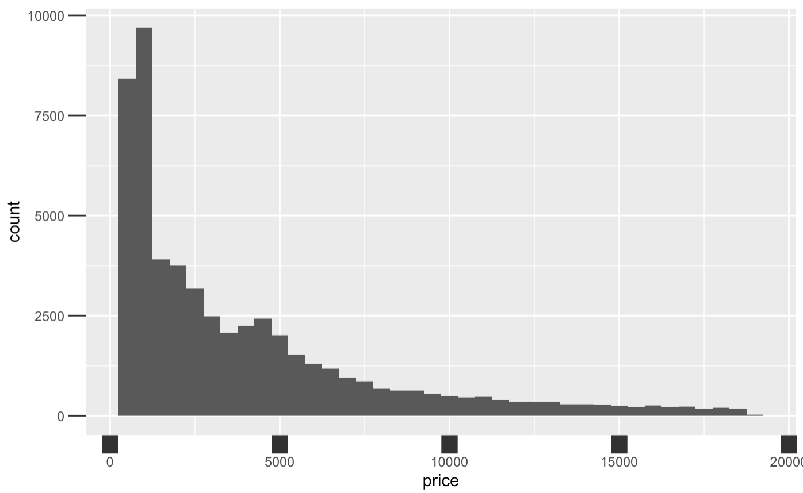

# Formatting Graph Axes

Graph axes have the power to manipulate the story of the data, and that is why formatting graph axis is an important skill in big data. When plotting relationship among variables of interest, one of the useful ways to create visual impact and clarity is by way of formatting the x and y axis. 

Different axis features that can be manipulated include:

- Axis titles (always set them to be readable! Rarely do you want whatever the variable name is in your statistics package)
- Axis scale (linear scale, logarithmic scale, reversed scale, etc.)
- Axis marks and labels (do you get a tick at 1, 2, 3, 4, and 5, or just 1, 3, and 5? Are the numeric values percentages? Numbers? In thousands or millions?)
- Axis limits (the range of x and y to show)


## Keep in Mind

- Visual appeal of your newly formatted graph. Who is the audience? What do you want them to notice? For example, for most common audiences you would want to avoid labeling your axes with scientific notation, as most people don't understand it.
- Caution: Use an appropriate scale when formatting your x and $y$ axis: You can manipulate data to say what you want it to, but using a more transparent approach is better practice.
- Changing the limits of the graph axes might make changes seem more or less dramatic. This comes up often in the debate of whether the y-axis on a line graph should always start from 0. If, for example, test scores dropped from 100 to 95, that change looks enormous if the y-axis goes from 94 to 100, with a change the size of the whole graph but looks pretty modest if the y-axis goes from 0 to 100 with a change the size of 5% of the graph.

## Also Consider

- It is important to know the basic plotting techniques such as [Line Graphs](/Presentation/Figures/line_graph_with_labels_at_the_beginning_or_end.html") and [Scatterplots]("/Presentation/Figures/scatterplot_by_group_on_shared_axes.html")

# Implementations

## R

Let's walk through an example in R to learn how to manipulate intervals on graph axes. The dataset used in this article example will be the `diamonds` dataset since it comes with the package **ggplot2**: you can follow along with this brief tutorial at home. This data reports prices of over 50,000 round cut diamonds.

```r?example=raxis
library(ggplot2)
```

Let's begin with a graph plotting price and clarity of a diamond, and seeing what it gives us as a default axis. We plot histogram in **ggplot2** by using the `ggplot()` function with the `diamonds` dataset, and adding `geom_density()` to plot a histogram. Aesthetic mappings describe how variables in the data are mapped to visual properties(aesthetics) of geoms. 

```r?example=raxis
diamonds %>% 
    ggplot() + 
    geom_histogram(binwidth=500, aes(x=price))
```



Now let's manipulate the four main elements of the axis: titles, scale, marks and ticks, value labels, and limits.

Axis titles can be changed using the `labs()` command. This works not only for the x and y axes, but also any other aesthetic that has a legend. (You can also set the title, subtitle, and caption in `labs()` - those aren't axes but a lot of people don't know you can use `labs()` for this! Who needs `ggtitle`?). We'll switch to `geom_density()` here so we can add, and then label, a `color` aesthetic.

```r?example=raxis
diamonds %>% ggplot() + 
  geom_density(aes(x=price, color = cut)) + 
  labs(x = 'Price',
       y = 'Density',
       color = 'Diamond Cut')
 ```
 
 

The scale and limits of the axes can be set using one of the `scale_` functions. `scale_x_log10()`, for example, will use a logarithmic scale for the x-axis. There are a lot of different `scale_` functions for different combinations of axis (including axes like color and shape, not just x and y) and scale type. You can use the `limits` argument inside of a `scale_` function to determine the limits of the axis. The limits can be outside the range of the data, "zooming out" on the graph, or inside the range of the data, cutting some of the data out of the graph. Note that using `limits` inside `scale_` will *remove all data outside the limits*. If you want to retain that data but just zoom the window in, instead look at the `xlim` and `ylim` arguments of `coord_cartesian()`. Note you can also use the `position` argument of `scale_x_` and `scale_y_` functions to move the axes themselves, perhaps putting the x-axis line at the `"top"` for example.

```r?example=raxis
diamonds %>% ggplot() + 
  geom_density(aes(x=price, color = cut)) + 
  labs(x = 'Price (Log Scale)',
       y = 'Density',
       color = 'Diamond Cut') + 
  scale_x_log10(limits = c(1, 5000)) # I use 1 instead of 0 here because log(0) is undefined
 ```
 
 
 
 Note how (1) the x-axis is now on a logarithmic scale, (2) the density numbers are different - density has been recalculated after dropping data outside the range, we haven't just "zoomed in", and (3) the graph begins and ends at our specified limits.

The `scale_` functions can also be used to label the values on the axes and specify how many tick marks there are. The `breaks` option lets you specify how many (or which) values get markers on the axis. The `labels` option lets you give it a function (or vector of values) that it uses to turn value labels in the data to printed labels on the graph. The **scales** package has a lot of good functions for use here in formatting numbers for print, like `number()`, `dollar()`, and `percent()`. These arguments canbe very useful in avoiding scientific notation, which **ggplot2** tends to default to in a lot of cases. `labels` is also handy for labeling discrete values. In this example `scale_color_discrete` is being used to relabel the categories in the legend, but this would also work if the `cut` variable were on the x-axis with `scale_x_discrete`.

```r?example=raxis
diamonds %>% ggplot() + 
  geom_density(aes(x=price, color = cut)) + 
  labs(x = 'Price (Log Scale)',
       y = 'Density',
       color = 'Diamond Cut') + 
  scale_x_log10(limits = c(1, 5000), breaks = c(100, 1000, 3000),
                labels = scales::dollar) +
  scale_color_discrete(labels = c('Fair' = 'Worst',
                                  'Good' = 'Okay',
                                  'Very Good' = 'Nice',
                                  'Premium' = 'Better',
                                  'Ideal' = 'Oh Dang'))
```


Note that if you don't like the **scales** function defaults, you can use an unnamed function. For example, `labels = function(x) scales::dollar(x, accuracy = 1)` (or `labels = \(x) scales::dollar(x, accuracy = 1)` in R 4.1) would get rid of those cents after the decimal place.

Finally, we can manipulate the *look* of the axes and ticks using the `theme()` function. The `axis.ticks` (or `axis.ticks.x` and `axis.ticks.y` to just change one of them) option takes an `element_line()` argument, in which you can set options like size, color, and so on. You can also change the `axis.line` (or `axis.line.x` and `axis.line.y`) options to change the look of the actual axis lines. There are also `axis.text` and `axis.title` options for changing how the text looks with `element_text()`.

Now, let's manipulate the size of the ticks on the x axis. Let's make them really wide for effect, and also really long. Let's choose "12 point unit" long length ticks for dramatic effect. 

```r?example=raxis
diamonds %>% ggplot()+ geom_histogram(binwidth=500, aes(x=price)) + 
  theme(axis.ticks.x = element_line(size = 5),
        axis.ticks.length = unit(12, "pt"))
```


