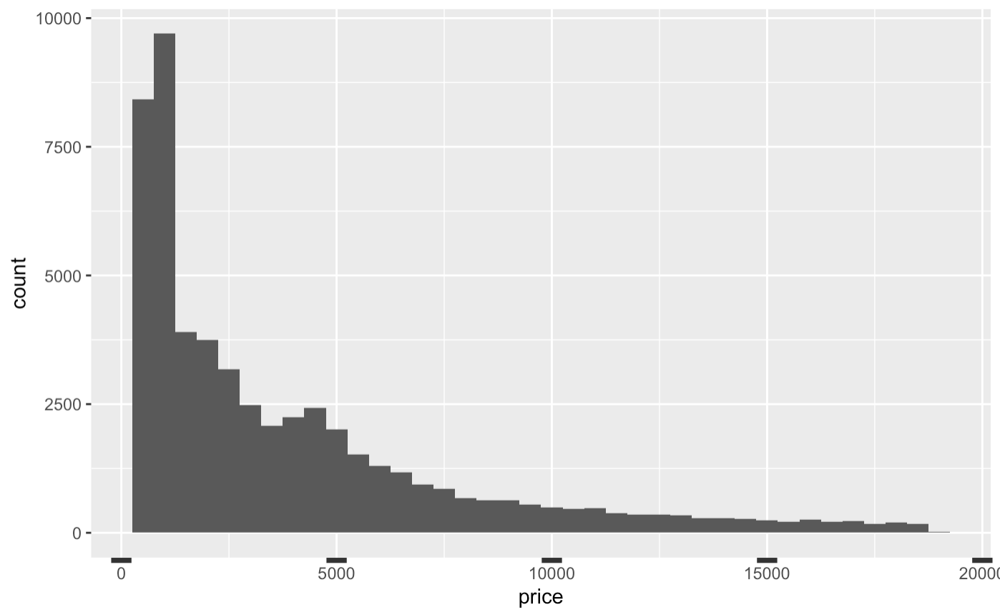
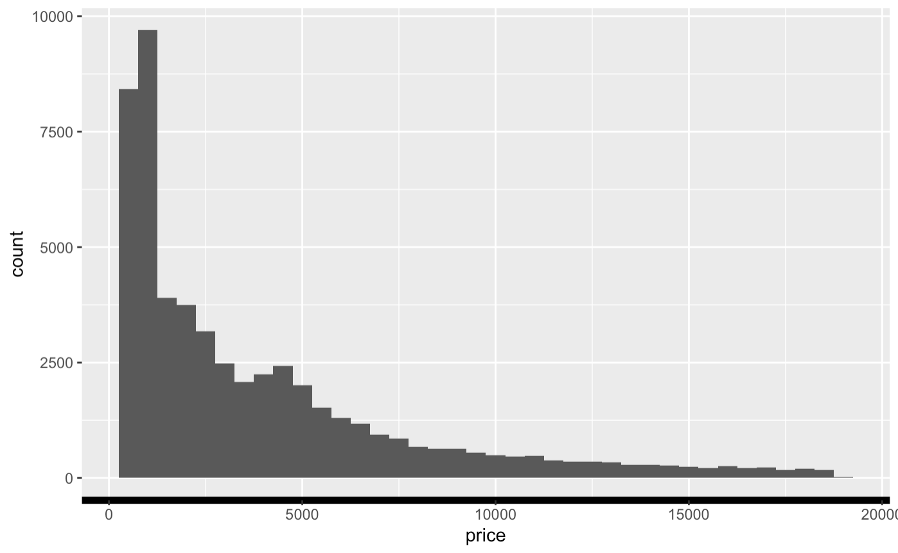
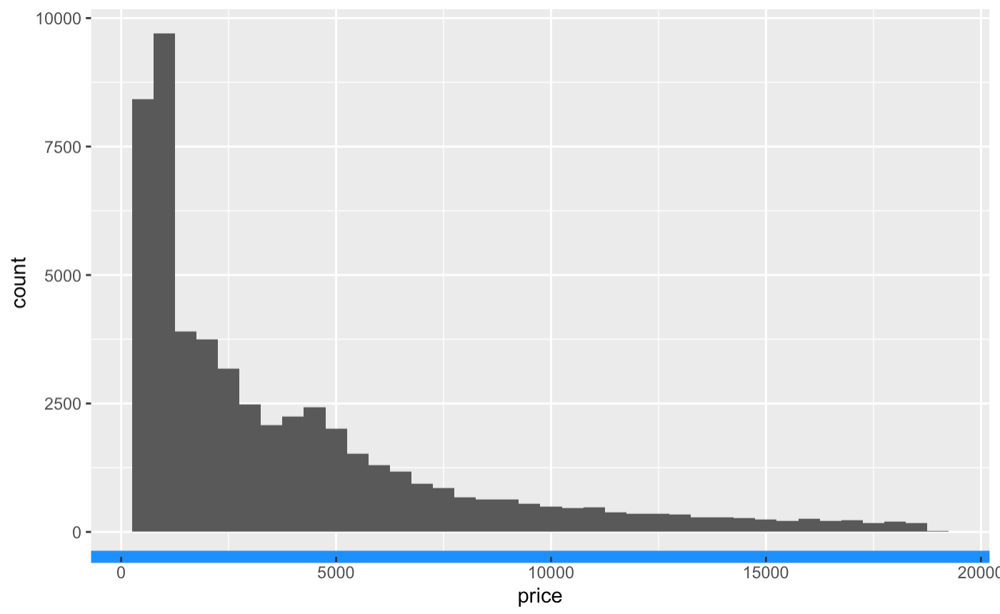
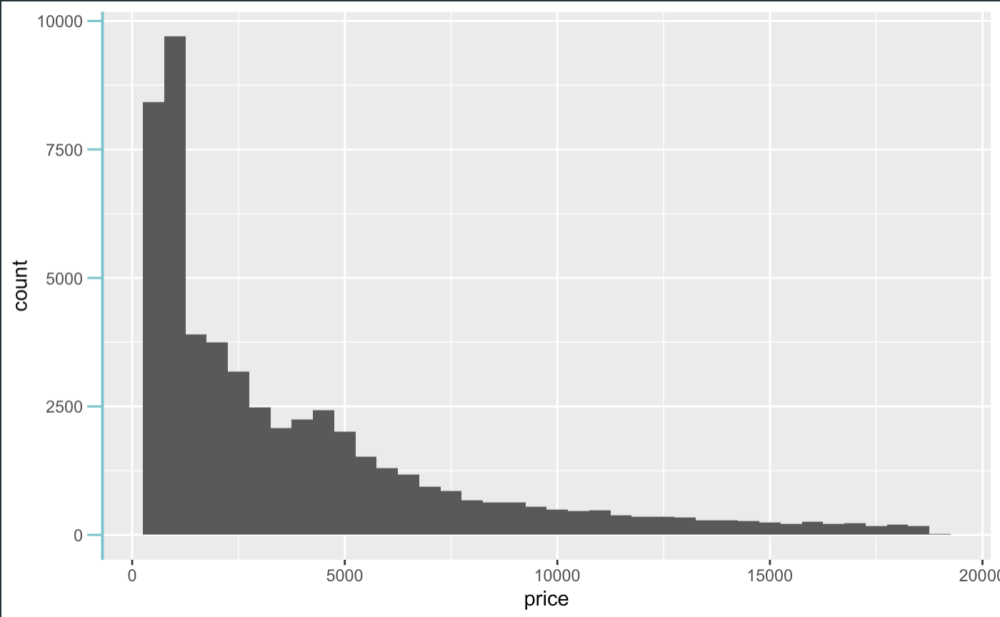

# Formatting Graph Axes

Graph axes have the power to manipulate the story of the data, and that is why formatting graph axis is an important skill in big data. When plotting relationship among variables of interest, one of the useful ways to create visual impact is by way of scaling the x and y axis. Data manipulation tools allow us to choose the intervals for the x and y axis when displaying results. It also gives us the ability to make the data say what we want it to. 

## Keep in Mind

- Visual appeal of your newly formatted graph. Who is the audience? What do you want them to notice?
- Caution: Use an appropriate scale when formatting your $x$ and $y$ axis: You can manipulate data to say what you want it to, but using a more transparent approach is better practice.
- Scaling the graph axes might scale the data to make it appear more/less dramatic. 

## Also Consider

- It is important to know the basic plotting techniques such as [Line Graphs](/Presentation/Figures/line_graph_with_labels_at_the_beginning_or_end.html") and [Scatterplots]("/Presentation/Figures/scatterplot_by_group_on_shared_axes.html")
- Graph Themes packages, like [hrbrthemes](https://rdocumentation.org/packages/hrbrthemes/versions/0.8.0) in R, provide easy implementations of displaying data in a multitude of ways.
- **Fun fact:** We can type `data()` into our console, and R will output us a list of available datasets in base R that we could use for practice.

# Implementations

## R

Let's walk through an example in R to learn how to manipulate intervals on graph axes. The dataset used in this article example will be the ***diamonds*** dataset since it comes with the package `ggplot2`: you can follow along with this brief tutorial at home. This data reports prices of over 50,000 round cut diamonds.

Here are some of the packages that will be used in this section:
```r?example=axis
library(dplyr)
library(ggplot)
library(hrbrthemes)
```
Let's begin with a graph plotting price and clarity of a diamond, and seeing what it gives us as a default axis. We plot histogram in ggplot2 by using ggplot() function to define diamonds dataset and add geom_histogram() function to plot histogram . Aesthetic mappings describe how variables in the data are mapped to visual properties(aesthetics) of geoms.
```r?example=axis
diamonds %>% ggplot()+ geom_histogram(binwidth=500, aes(x=price))
```


Now, let's manipulate the siz of the ticks on the x axis. Let's make them really wide for effect. 
```r?example=axis
 diamonds %>% ggplot()+ geom_histogram(binwidth=500, aes(x=price)) + 
  theme(axis.ticks.x = element_line(size = 5))
```

... but we could also manipulate the length of the x axis ticks. Again, let's choose "12 point unit" long length ticks for dramatic effect. 

```r?example=axis
diamonds %>% ggplot()+ geom_histogram(binwidth=500, aes(x=price)) + 
  theme(axis.ticks.x = element_line(size = 5),
        axis.ticks.length = unit(12, "pt"))
```


Now let's manipulate the boldness of the graph axes. 
```r?example=axis
diamonds %>% ggplot()+ geom_histogram(binwidth=500, aes(x=price)) + 
  theme(axis.line.x = element_line(size = 2))
```

And color.
```r?example=axis
diamonds %>% ggplot()+ geom_histogram(binwidth=500, aes(x=price)) + 
  theme(axis.line.x = element_line(size = 3, color = "dodgerblue"))
```

Of  course, replacing each command of $x$ with $y$ works for the y axis as well. 

```r?example=axis
diamonds %>% ggplot()+ geom_histogram(binwidth=500, aes(x=price)) + 
  theme(axis.line.y = element_line(size = 0.7,  color = "cadetblue3"),
        axis.ticks.y = element_line(size = 0.55, color = "cadetblue3"),
        axis.ticks.length.y = unit(8, "pt"))
```



