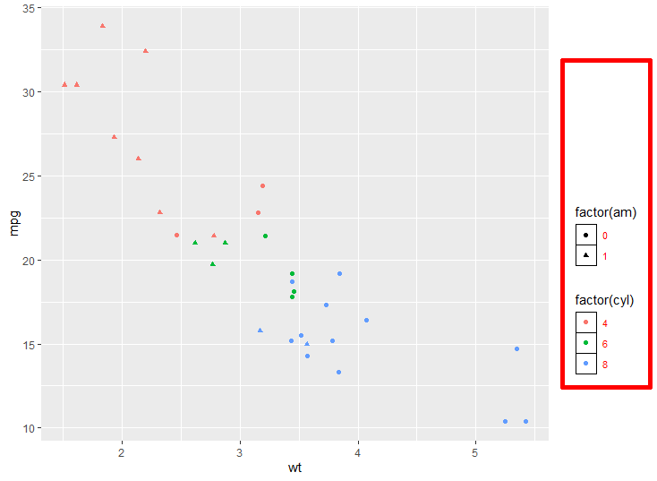
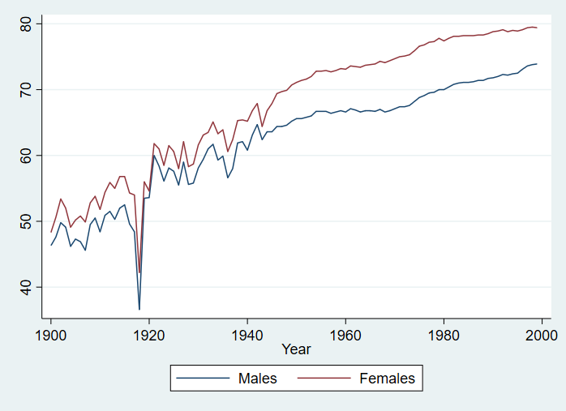
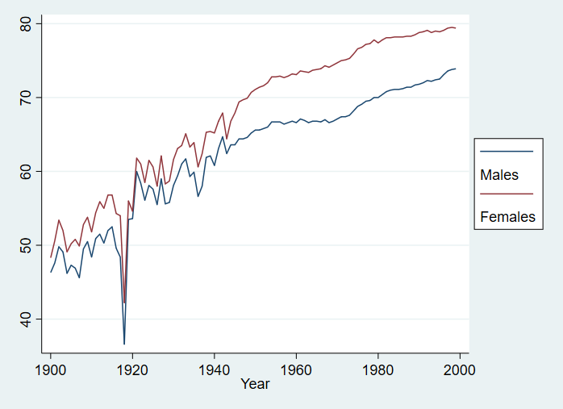
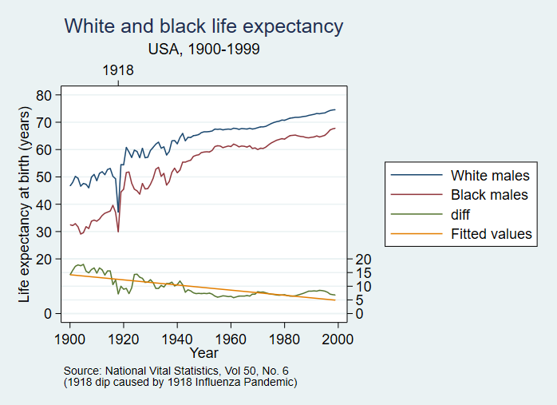

## Formatting Graph Legends

Graph legends are an important part of data representation, as they enable the reader to better under stand the figure infront of them while not cluttering the figure itself. Legends can often be seen next to graphs describing some of aspect of a graph.
For more information on graphs see other articles such as: bar graphs, scatter plots and histograms.

## Keep in Mind

- Title: A legend should be well-titled so you can tell what the different component elements, like any key symbols, colors, scale changes, lines or other compeents mean. 
- Some more extended legends cal also include very brief information about methods or results, as simplified as possible.
- Avoid clutter: It is important to keep these legends simple, an effective legend is there to help the graph stand alone.
- Ask if a legend is *necessary*. You may be able to move labels for things like colors or shapes onto the graph itself where it is more closely tied to the data. Or you may be able to make things self-explanatory with a good graph title.

## Also Consider

- Before finalizing your legend the graph itself should be completed. Deciding which type of graph is best suited for your data is a whole topic in itself. 
- Some of the graphical implementations this page contains include are;
[Bar Graphs]({{ "/Presentation/Figures/bar_graphs.html" | relative_url }}), [Histograms]({{ "/Presentation/Figures/histograms.html" | relative_url }}), and [Scatterplot by Group on Shared Axes]({{ "/Presentation/Figures/scatterplot_by_group_on_shared_axes.html" | relative_url }}). 
- Check out [this article](https://www.ncbi.nlm.nih.gov/pmc/articles/PMC4078179/) for a brief description of the relationships shown for different graph types . 

# Graphs legends in R

Here are some of the packages that will be used in this section:
```r
if (!require("pacman")) install.packages("pacman")
pacman::p_load(ggplot2)
```

The dataset used in this article will be the ***mtcars*** dataset as it comes with base R. The functions here are `ggplot` and `geom_point` from the ***ggplot2*** package. `geom_point` creates a scatterplot while in `ggplot` we will assign the axis and the legend. More specifically, in `aes()` we color the point depending on the number of cylinders.

```r
fig1 <- ggplot(mtcars, aes(wt, mpg, colour = factor(cyl))) +
       geom_point()
fig1
```

Now we can add another layor by giving each type of transition a different shape through shape in `aes()`. Additionally, you can augment the labels for both colour and shape with `labs()`.

```r
fig2 <- ggplot(mtcars, aes(wt, mpg, colour = factor(cyl), shape = factor(am) )) +
  geom_point()
  
fig2 + labs(colour= "Number of Cylinders", shape = "Transmission Type")

```

To change the legend position use the `theme()` modifier in ggplot. From there you can choose top, right, bottom, left, or none (removes the legend). To put the legends inside the plot create column vector of size 2 (the first value refers to the x coordinate. while the second refers to the y) where both elements are between 0 and 1. To ensure that the whole legends is within the graph use the `legend.justification` to set the corner where you want the legend.

```r
fig2 + 
    theme(
    legend.position = c(.95, .95),
    legend.justification = c("right", "top")
    )
  
```

There are other cool things you can do to the legend to better customize the visual experience by adding more to the ***theme*** modifier such as:
* Changing the margin size with `legend.box.margin`
* The color of the box around the legend with `legend.box.background`
* Changing the font size and color with `legend.text`
* Changing the boxes of the legend key with `legend.key`
```r
fig3 <- fig2 +
  theme(
    legend.box.background = element_rect(color="red", size=2),
    legend.box.margin = margin(116, 6, 6, 6),
    legend.key = element_rect(fill = "white", colour = "black"),
    legend.text = element_text(size = 8, colour = "red")
  )
fig3
```



Sometimes you may want to remove a legend for the sake of graph readability or to reduce clutter. You can remove a legend by changing its position to "none" within the `theme` modifier.
```r
fig4 <- fig2 +
       theme(legend.postion="none")
fig4
```

You can alternately remove legends (or components of legends) with `guides`

```r
# Here we've removed the color legend, but the shape legend is still there.
fig5 <- fig2 +
       guides(color = FALSE)
fig5
# This removes both
fig6 <- fig2 +
       guides(color = FALSE, shape = FALSE)
fig6
```


# Legend Formatting in Stata

In Stata the legend is automatically added when you create a graph with multiple lines. However there may be instances where you would still prefer to have a legend on a single line graph or possibly no legend on your graph in general. For those times just add `legend(on)` or `legend(off)`. 

```stata
* Let's use the US Life Expectancy data that comes with Stata
sysuse uslifeexp.dta, clear
line le year, legend(on)
```

Labelling legends is also straight forward, within the legend function add `label(n "line title")` to augment the titles, where 'n' is the nth group.

```stata
line le_m le_f year, legend(label(1 "Males") label(2 "Females"))

```


Legend position can be changed with the `position()`, `col()`, and `ring()` modifiers in the `legend()` function. Here `position` refers to where the legend is placed with respect to the center of the graph using clock directions (i.e. 6 is 6 o'clock or below and 3 is 3 o'clock or right). `col()` is the number of columns the legend will take up, usually you just want to set the to be 1 to prevent the graph and legend fighting over space. `ring()` refers to the distance away from the center of the graph.

```stata
line le_m le_f year, legend(pos(3) col(1) lab(1 "Males") lab(2 "Females") stack)

```


Then you can add some color to the legend with region() and a title with subtitle():

```stata
line le_m le_f year, legend(pos(5) ring(0) col(1) lab(1 "Males") lab(2 "Females") region(fcolor(gs15))) legend(subtitle("Legend"))
```


In the case where you are dealing with a two-way or a combination of graphs, augmenting the legend is exactly like above only now you must specify the line which you want to augment. Take this example from the stata manual on two-way graphs:

```stata
line le_wm year, yaxis(1 2) xaxis(1 2) ///
	|| line le_bm year ///
	|| line diff year ///
	|| lfit diff year ///
	||, ///
	ylabel(0(5)20, axis(2) gmin angle(horizontal)) ///
	ylabel(0 20(10)80, gmax angle(horizontal)) ///
	ytitle("", axis(2)) ///
	xlabel(1918, axis(2)) xtitle("", axis(2)) ///
	ylabel(, axis(2) grid) ///
	ytitle("Life expectancy at birth (years)") ///
	title("White and black life expectancy") ///
	subtitle("USA, 1900-1999") ///
	note("Source: National Vital Statistics, Vol 50, No. 6" ///
	"(1918 dip caused by 1918 Influenza Pandemic)") ///
	legend(label(1 "White males") label(2 "Black males")) ///
	legend(col(1) pos(3))
```



***Notice*** within the `label()` command nested within `legend()` you must specify which part of the graph  you're labeling first (the number denotes its order i.e. the first graph is 1) then the new label with a space between both items. Here they change the legend label for the first 2 lines.
In regards to legend positioning, the same rules discussed above apply.

#Sources
Stata's manual on two-way graphs: https://www.stata.com/manuals13/g-2graphtwowayline.pdf
Stata's manual on legends: https://www.stata.com/manuals13/g-3legend_options.pdf
