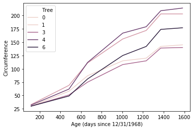
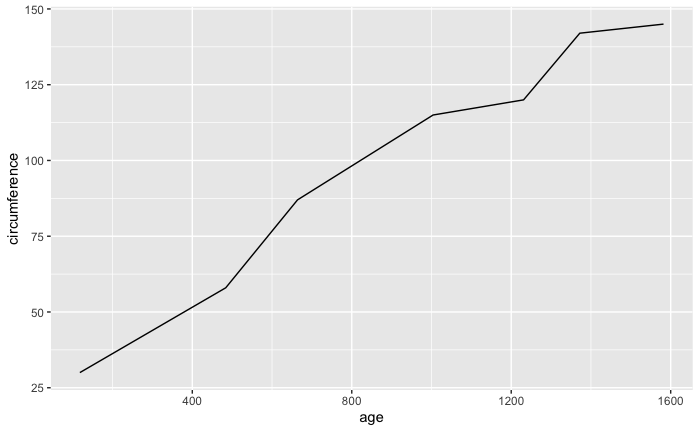
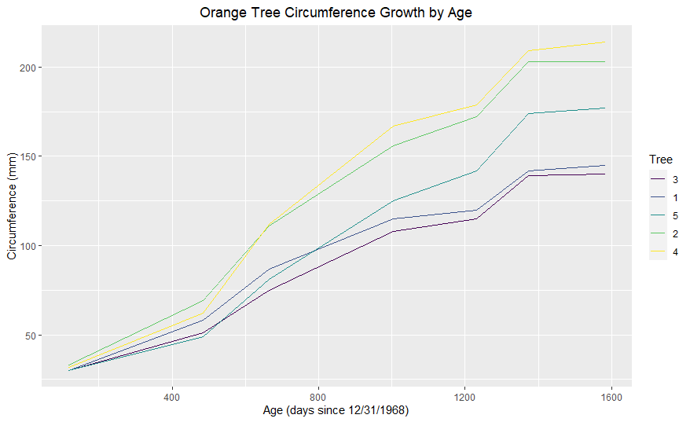
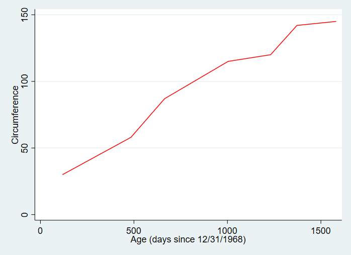
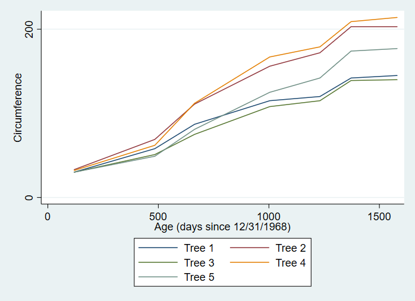

# Line Graphs

A line graph is a visualization tool that shows how a value changes over time. A line graph can contain a single line or multiple lines in order to compare how multiple different values change over time.

## Keep in Mind

- Keep things simple. With line graphs, more is not always better. It's important that line graphs are kept clean and concise so that they can be interpreted quickly and easily. Including too many lines or axis tick marks can make your graph messy and difficult to read. 
- The time variable should be on the x-axis for straightforward interpretation.

## Also Consider

- To enhance a basic line graph, see [Styling Line Graphs]({{ "/Presentation/Figures/styling_line_graphs.html" | relative_url }}) and [Line Graph with Labels at the Beginning or End of Lines]({{ "/Presentation/Figures/line_graph_with_labels_at_the_beginning_or_end.html" | relative_url }}).


# Implementations


## Python

Here we will use `seaborn.lineplot` from the **seaborn** package, which builds on top of **matplotlib**.

```python
# Load packages
import pandas as pd
import matplotlib.pyplot as plt
import seaborn as sns

# Load in data
Orange = pd.read_csv('https://vincentarelbundock.github.io/Rdatasets/csv/datasets/Orange.csv')

# Specify a line plot in Seaborn using
# age and circumference on the x and y axis
# and picking just Tree 1 from the data
sns.lineplot(x = 'age',
             y = 'circumference',
             data = Orange.loc[Orange.Tree == 1])
# And title the axes
plt.xlabel('Age (days since 12/31/1968)')
plt.ylabel('Circumference')
```

The result is:


If we want to include all the trees on the graph, with color to distinguish them, we add a `hue` argument:

```python
# Add on a hue axis to add objects of different color by tree
# So we can graph all the trees
sns.lineplot(x = 'age',
             y = 'circumference',
             hue = 'Tree',
             data = Orange)
# And title the axes
plt.xlabel('Age (days since 12/31/1968)')
plt.ylabel('Circumference')
```

Which results in:



## R

### Basic Line Graph in R

To make a line graph in R, we'll be using a dataset that's already built in to R, called 'Orange'. This dataset tracks the growth in circumference of several trees as they age.

```R
#load necessary packages
if (!require("pacman")) install.packages("pacman")
pacman::p_load(dplyr, lubridate)
#load in dataset
data(Orange)
```

This dataset has measurements for four different trees. To start off, we'll only be graphing the growth of Tree #1, so we first need to subset our data. 

```R
#subset data to just tree #1
tree_1_df <- Orange %>%
                filter(Tree == 1)
```

Then we will construct our plot using `ggplot()`. We'll create our line graph using the following steps:

 - First, call `ggplot()` and specify the `tree_1_df` dataset. Next, we need to specify the aesthetics of our graph (what variables go where). Do so with the `aes()` function, setting `x = age` and `y = circumference`.
 - To make the actual line of the line graph, we will add the line geom_line() to our ggplot line using the `+` symbol. Using the `+` symbol allows us to add different lines of code to the same graph in order to create new elements within it.
 - Putting those steps together, we get the following code resulting in our first line graph:

```R
ggplot(tree_1_df, aes(x = age, y = circumference)) +
            geom_line()
```



This does show us how the tree grows over time, but it's rather plain and lacks important identifying information like a title and units of measurements for the axes. In order to enhance our graph, we again use the `+` symbol to add additional elements like line color, titles etc. and to change things like axis labels and title/label position. 

- We can specify the color of our line within the `geom_line()` function.
- The function `labs()` allows us to add a title and also change the labels for the axes
- Using the function `theme()` allows us to manipulate the apperance of our labels through the element_text function
- Let's change the line color, add a title and center it, and also add more information to our axes labels.

```R
ggplot(tree_1_df, aes(x = age, y = circumference)) +
            geom_line(color = "orange") +
            labs(x = "Age (days since 12/31/1968)", y = "Circumference (mm)", 
                 title = "Orange Tree Circumference Growth by Age") +
            theme(plot.title = element_text(hjust = 0.5))
```


### Line Graph with Multiple Lines in R

A great way to employ line graphs is to compare the changes of different values over the same time period. For this instance, we'll be looking at how the four trees differ in their growth over time. We will be employing the full `Orange` dataset for this graph.

To add multiple lines using data from the same dataframe, simply add the `color` argument to the `aes()` function within our `ggplot()` line. Set the color argument to the identifying variable within your data set, here, that variable is `Tree`, so we will set `color = Tree`.

```R
ggplot(Orange, aes(x = age, y = circumference, color = Tree)) +
        geom_line() + 
        labs(x = "Age (days since 12/31/1968)", y = "Circumference (mm)", title = "Orange Tree Circumference Growth by Age") +
        theme(plot.title = element_text(hjust = 0.5))
```


The steps will get you started with creating graphs in R. For more information on styling your graphs, again, visit [Styling Line Graphs]({{ "/Presentation/Figures/styling_line_graphs.html" | relative_url }}) and [Line Graph with Labels at the Beginning or End of Lines]({{ "/Presentation/Figures/line_graph_with_labels_at_the_beginning_or_end.html" | relative_url }}).

Another great resource for line graph styling tips is [this blog post](http://t-redactyl.io/blog/2015/12/creating-plots-in-r-using-ggplot2-part-1-line-plots.html) created by Jodie Burchell. 

## Stata

We can create a line graph in Stata using the `twoway` function with the `line` setting.

```stata
* Load data on orange trees
import delimited "https://vincentarelbundock.github.io/Rdatasets/csv/datasets/Orange.csv", clear

* Let's just graph the first tree using if Tree == 1
* We specify the y-axis variable circumference first followed by the x-axis variable age
* We can add axis labels with xtitle and ytitle
* And specify a color with lcolor (for line color)
twoway line circumference age if tree == 1, xtitle("Age (days since 12/31/1968)") ytitle("Circumference") lcolor(red)
```

The result is:



We can also include all the trees on the same line graph:

```stata
* If we want all of our trees graphed on the same axis
* We can specify each line separately using ()
* Use legend() so we know which line is which
* Or label the lines directly using {{ "/Presentation/Figures/line_graph_with_labels_at_the_beginning_or_end.html" | relative_url }}
twoway (line circumference age if tree == 1) (line circumference age if tree == 2) (line circumference age if tree == 3) (line circumference age if tree == 4) (line circumference age if tree == 5), xtitle("Age (days since 12/31/1968)") ytitle("Circumference") legend(lab(1 "Tree 1") lab(2 "Tree 2") lab(3 "Tree 3") lab(4 "Tree 4") lab(5 "Tree 5"))
```

The result is:



