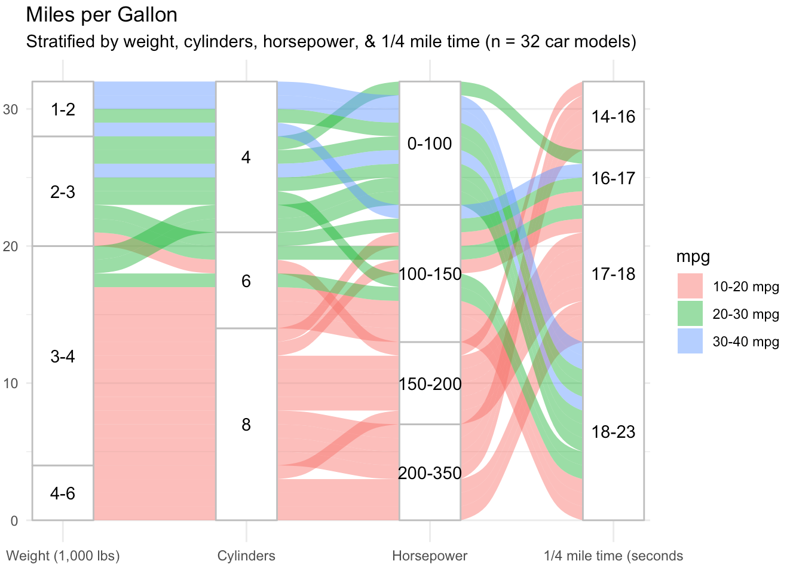

# Sankey Diagrams

Sankey diagrams are visual displays that represent a data flow across sequential points of change, sorting, or decision. They can be used to track decision-making, behavioral patterns, resource flow, or as a method to display time series data, among other uses.

## Keep in Mind

- A Sankey diagram is comprised of stacked categorical variables, with each variable on its own vertical axis.
- Categorical flow points are generally referred to as "nodes." 
- Horizontal lines or bands show the density of variables at each node and the subsequent distribution onto the next variable.

## Also Consider

- Variables should generally be categorical, as continuous values will typically not work in this setting.
- Too few or too many categories can make a Sankey diagram less effective. Segmenting or grouping variables may be useful.
- Sankey diagrams are sometimes known as alluvial diagrams, though the latter is often used to describe changes over time.

# Implementations

## R

There are many excellent packages in R for making Sankey diagrams (**networkD3**, **alluvial**, and **ggforce** among them), but let's begin by looking at the **highcharter** package. It is an R wrapper for the Highcharts Javascript library and a powerful tool. It's also easy to get up and running quickly, while some other packages may require more preliminary data wrangling. We begin by loading **pacman** and **dplyr**.

```r
library(pacman)
p_load(dplyr)
```

Next, we bring in the **highcharter** package and import a csv file that includes data from the 2020-2021 NBA season, including team, division, winning percentage, playoff seeding, and appearance in the conference semifinals. We change the winning percentage "win_perc" variable to a character so that it functions appropriately in this setting and take a look at the first few rows.

```r
p_load(highcharter)
nba = read.csv("https://github.com/LOST-STATS/lost-stats.github.io/raw/source/Presentation/Figures/Data/Sankey_Diagrams/NBA.csv")
nba$win_perc <- as.character(nba$win_perc)
head(nba)
```

Now we simply use "data_to_sankey" within the hchart function to create our Sankey diagram. We see that the data flows in the same order as our data frame, from individual team to conference, and then from winning percentage and playoff position to whether the team made the conference semifinals. I have chosen the theme ggplot2 but there are many nice options.

```r
hchart(data_to_sankey(nba), "sankey", name = "Number of teams") %>%
  hc_title(text= "NBA 2020-2021 Season") %>%
  hc_subtitle(text= "Team --- Conference --- Winning Percentage --- Playoff Position --- Advancement to Conference Semifinals") %>%
  hc_add_theme(hc_theme_ggplot2()) %>%
  hc_plotOptions(series = list(dataLabels = list( style = list(fontSize = "10px"))))
```


Dynamically hovering the cursor over each node or branch gives us a count of how many teams went to each of the next nodes. For instance, we see that 3 teams from the West had a winning percentage of 0.4. Also, between the last two nodes we see that one top 4 seed did not advance to the conference semifinals and one 5 to 8 seed did.

Next, we look at the **ggalluvial** package, which is an extension for the **ggplot2** package. This, too, is simple to get started. In fact, the bulk of the code here is manipulating the familiar mtcars data set such that hp, wt, mpg, and qsec are made categorical from their original numeric values. This fact underscores one way the Sankey diagram is useful. Namely, that values can be essentially binned in order to see trends in data flow. We load the package and mtcars, do our data wrangling, and check out the first few rows.

```r
p_load(ggplot2, ggalluvial)
data(mtcars)
mtc = mtcars %>%
  select(cyl, hp, wt, qsec, mpg) %>%
 mutate(
       hp = case_when(
         hp <= 100 ~ "0-100",
         hp <= 150 ~ "100-150",
         hp <= 200 ~ "150-200",
         hp <= 500 ~ "200-350"),
         wt = case_when(
           wt <= 2 ~ "1-2",
           wt <= 3 ~ "2-3",
           wt <= 4 ~ "3-4",
           wt <= 7 ~ "4-6"),
         mpg = case_when(
           mpg <= 20 ~ "10-20 mpg",
           mpg <= 30 ~ "20-30 mpg",
           mpg <= 50 ~ "30-40 mpg"),
       qsec = case_when(
         qsec <= 16 ~ "14-16",
         qsec <= 17 ~ "16-17",
         qsec <= 18 ~ "17-18",
         qsec <= 23 ~ "18-23"
       ))
head(mtc)
```

Next, we use the familiar ggplot and include the line "geom_alluvium" to induce an alluvial diagram. We can interpret that weight and number of cylinders are highly correlated but that horsepower and the quarter-mile time are less so.

```r
ggplot(data = mtc,
       aes(axis1 = wt, axis2 = cyl, axis3 = hp, axis4 = qsec)) +
  scale_x_discrete(limits = c("Weight (1,000 lbs)", "Cylinders", "Horsepower", "1/4 mile time (seconds"), expand = c(.05, .05)) +
  geom_alluvium(aes(fill = mpg)) +
  geom_stratum(color = "grey") +
  geom_text(stat = "stratum", aes(label = after_stat(stratum))) +
  theme_minimal() +
  ggtitle("Miles per Gallon",
          "Stratified by weight, cylinders, horsepower, & 1/4 mile time (n = 32 car models)")
```



We see four variables (wt, cyl, hp, and qsec) in columns, with the proportion of each category represented by the height of the node. In this package, it is easier to see the distribution of each variable because columns are all the same height and frequency of categorical values is proportional. The y axis is a measure of the number of observations in our sample. Additionally, our fifth variable, mpg, is color coded in bands across the diagram, allowing us to highlight a particular aspect of this data set. These are relatively basic examples, but in a few lines of code demonstrate the usefulness of a Sankey diagram to track the flow and distribution of variables in a data set.
