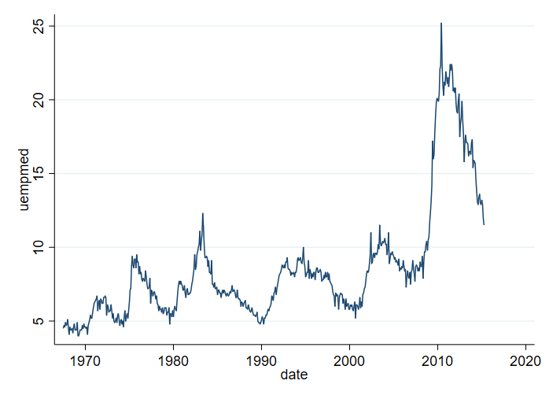
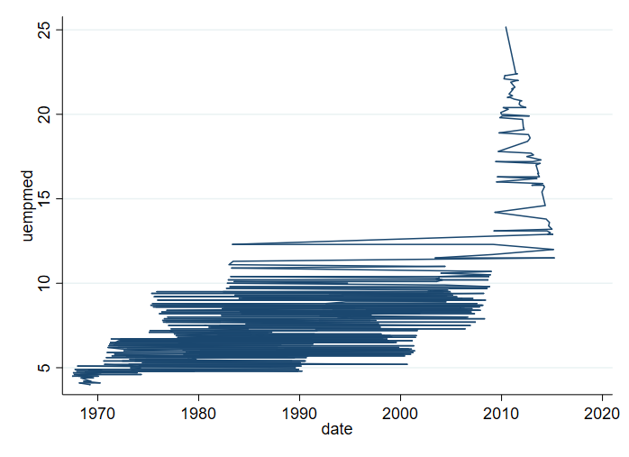
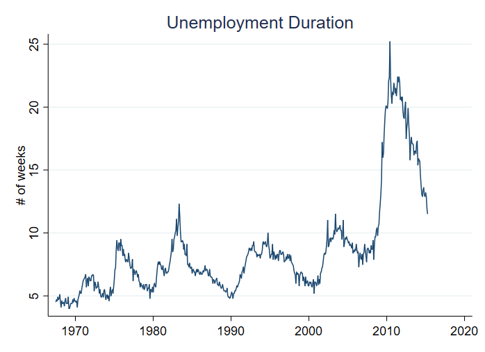
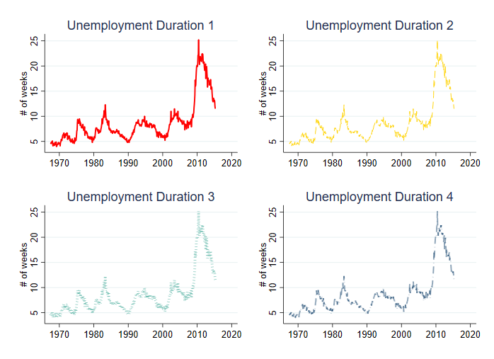
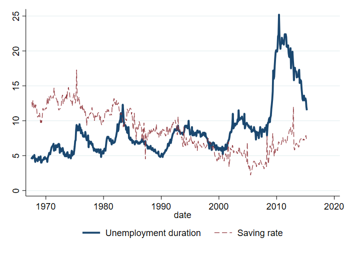
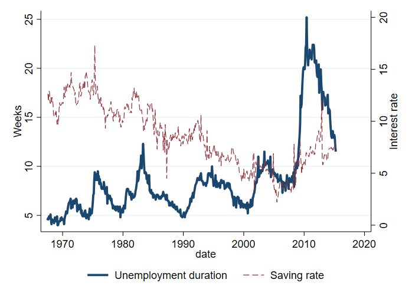
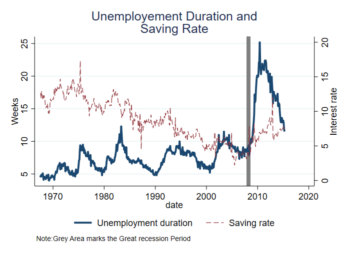

# Styling Line Graphs

There are several ways of styling line graphs. The following examples demonstrate how to modify the appearances of the lines
(type and sizes), as well chart titles and axes labels.

## Keep in Mind
- To get started on how to plot line graphs, see [here]({{ "/Presentation/Figures/line_graph_with_labels_at_the_beginning_or_end.html" | relative_url }}).
- Elements for customization include line thickness, line type (solid, dashed, etc.), shade, transparency, and color.
- Color is one of the easiest ways to distinguish a large number of line graphs. If you have many line graphs overlaid and have to use black-and-white, consider different shades of black/gray.

# Implementation

## R
```r
## If necessary
## install.packages(c('ggplot2','cowplot'))
## load packages
library(ggplot2)
## Cowplot is just to join together the four graphs at the end
library(cowplot)

## load data (the Economics dataset comes with ggplot2)
eco_df <- economics

## basic plot
p1 <- ggplot() +
  geom_line(aes(x=date, y = uempmed), data = eco_df)
p1

## Change line color and chart labels
## Note here that color is *outside* of the aes() argument, and so this will color the line
## If color were instead *inside* aes() and set to a factor variable, ggplot would create
## a different line for each value of the factor variable, colored differently.
p2 <- ggplot() +
  ## choose a color of preference
  geom_line(aes(x=date, y = uempmed), color = "navyblue", data = eco_df) +
  ## add chart title and change axes labels
  labs(
    title = "Median Duration of Unemployment",
    x = "Date",
    y = "") +
  ## Add a ggplot theme
  theme_light()
  ## center the chart title
  theme(plot.title = element_text(hjust = 0.5)) +

p2

## plotting multiple charts (of different line types and sizes)
p3 <-ggplot() +
  geom_line(aes(x=date, y = uempmed), color = "navyblue",
            size = 1.5, data = eco_df) +
  geom_line(aes(x=date, y = psavert), color = "red2",
            linetype = "dotted", size = 0.8, data = eco_df) +
  labs(
    title = "Unemployment Duration (Blue) and Savings Rate (Red)",
    x = "Date",
    y = "") +
  theme_light() +
  theme(plot.title = element_text(hjust = 0.5))

p3

## Plotting a different line type for each group
## There isn't a natural factor in this data so let's just duplicate the data and make one up
eco_df$fac <- factor(1, levels = c(1,2))
eco_df2 <- eco_df
eco_df2$fac <- 2
eco_df2$uempmed <- eco_df2$uempmed - 2 + rnorm(nrow(eco_df2))
eco_df <- rbind(eco_df, eco_df2)
p4 <- ggplot() +
  ## This time, color goes inside aes
  geom_line(aes(x=date, y = uempmed, color = fac), data = eco_df) +
  ## add chart title and change axes labels
  labs(
    title = "Median Duration of Unemployment",
    x = "Date",
    y = "") +
  ## Add a ggplot theme
  theme_light() +
  ## center the chart title
  theme(plot.title = element_text(hjust = 0.5),
        ## Move the legend onto some blank space on the diagram
        legend.position = c(.25,.8),
        ## And put a box around it
        legend.background = element_rect(color="black")) +
  ## Retitle the legend that pops up to explain the discrete (factor) difference in colors
  ## (note if we just want a name change we could do guides(color = guide_legend(title = 'Random Factor')) instead)
  scale_color_manual(name = "Random Factor",
                     # And specify the colors for the factor levels (1 and 2) by hand if we like
                     values = c("1" = "red", "2" = "blue"))
p4

# Put them all together with cowplot for LOST upload
plot_grid(p1,p2,p3,p4, nrow=2)
```
The four plots generated by the code are (in order p1, p2, then p3 and p4):


## Stata

In Stata, one can create plot lines using the command `line`, which in combination with `twoway` allows you to modify components of sub-plots individually. In this demonstration, I will use minimal formatting, but will apply minimal modifications using Ben Jann's `grstyle`. 

```stata
** Setup: Install grstyle
ssc install grstyle
grstyle init
grstyle color background white
grstyle set legend, nobox
```

### Setup
First, you need to load the data into Stata. The data is a copy from the data `economics` available within `ggplot` package, and translated using `foreign`.

```stata
use https://friosavila.github.io/playingwithstata/rnd_dta/economics, clear
** Since this was taken directly from R, the date variable will not be formatted.
** We can format the date using the following.
format date %tdCCYY
** This indicates to create a _mask_, to put on top of "data"
** but only display the "year"
```

### Simple line plot
Now, For a simple plot, we could use the following syntax:

```stata
line yvar1 [yvar2 yvar3 ...] xvar1
```

This requests plotting all variables `yvarX` against `xvar1` (horizontal axis). Internally, the command connects every pair of data `[yvar1,xvar1]` sequentially, based on the order they appear in the dataset.
Below, we can do that, plotting unemployment duration `uempmed` vs `date`.

```stata
line uempmed date
```



Something to keep in mind. If the dataset is not sorted by `date`, you may end up with a lineplot that is all over the place. For example:

```stata
sort uempmed
line uempmed date
```


To avoid this, it is recommended to use the option `sort`.

```stata
line uempmed date, sort
```


### Adding titles, and axis titles

The next thing you may want to do is add information to the plot, so its easier to understand what the figure is showing. Specifically, we can add information on the vertical axis using `ytitle()`. I will also use `xtitle()` to drop the horizontal axis information, and add a title `title()`.

```stata
line  uempmed date, sort ///
      ytitle("# of weeks") xtitle("") ///
      title(Unemployment Duration)
```


### Changing Line characteristics.
It is also possible to modify the line width `lwidth()`, line color `lcolor()`, and line pattern `lpattern()`. To show how this can affect the plot, below 4 examples are provided. 

Notice that each plot is saved in memory using `name()`, and all are combined using `graph combine`.

```stata
line uempmed date, sort ///
ytitle("# of weeks") xtitle("") ///
title(Unemployment Duration 1) ///
lwidth(.5) lcolor(red) lpattern(solid) name(m1,replace)

line uempmed date, sort ///
ytitle("# of weeks") xtitle("") ///
title(Unemployment Duration 2) ///
lwidth(.25) lcolor(gold) lpattern(dash) name(m2,replace)

line uempmed date, sort ///
ytitle("# of weeks") xtitle("") ///
title(Unemployment Duration 3) ///
lwidth(1) lcolor("68 170 153") lpattern(dot) name(m3,replace)

line uempmed date, sort ///
ytitle("# of weeks") xtitle("") ///
title(Unemployment Duration 4) ///
lwidth(.5) lcolor(navy%50) lpattern(dash_dot) name(m4,replace)

graph combine m1 m2 m3 m4
```


### Ploting Multiple Lines, and different axis
You may also want to plot multiple variables in the same figure. There are two ways to do this:

```stata
twoway  (line uempmed date, sort lwidth(.75) lpattern(solid) ) ///
        (line psavert date, sort lwidth(.25) lpattern(dash) ), ///
        legend (order(1 "Unemployment duration" 2 "Saving rate")) 
  
line  uempmed psavert  date, sort lwidth(0.75 .25) lpattern(solid dash) ///
      legend(order(1 "Unemployment duration" 2 "Saving rate")) 
```   
Both options provide the same figure, however, I prefer the first option since that allows for more flexibility.



You can also choose to plot each variable in a different `axis`. Each axis can have its own title.

```stata
twoway  (line uempmed date, sort lwidth(.75) lpattern(solid) yaxis(1)) ///
        (line psavert date, sort lwidth(.25) lpattern(dash) yaxis(2)), ///
    legend(order(1 "Unemployment duration" 2 "Saving rate")) ///
    ytitle(Weeks ,axis(1) ) ytitle(Interest rate,axis(2) ) 
```


### Adding informative Vertical lines.

Finally, it is possible to add vertical lines. This may be useful, for example, to differentiate the great recession period. Additionally, in this plot, I add a note.

```stata    
twoway  (line uempmed date, sort lwidth(.75) lpattern(solid) yaxis(1)) ///
        (line psavert date, sort lwidth(.25) lpattern(dash) yaxis(2)), ///
        legend(order(1 "Unemployment duration" 2 "Saving rate")) ///
        ytitle(Weeks ,axis(1) ) ytitle(Interest rate,axis(2) )  ///
        xline(`=td(1dec2007)'/`=td(30jun2008)', lcolor(gs8)) ///
        note("Note:Grey Area marks the Great recession Period") ///
        title("Unemployement Duration and" "Saving Rate")
```


