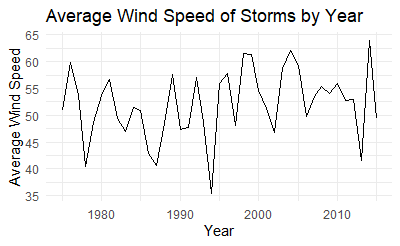
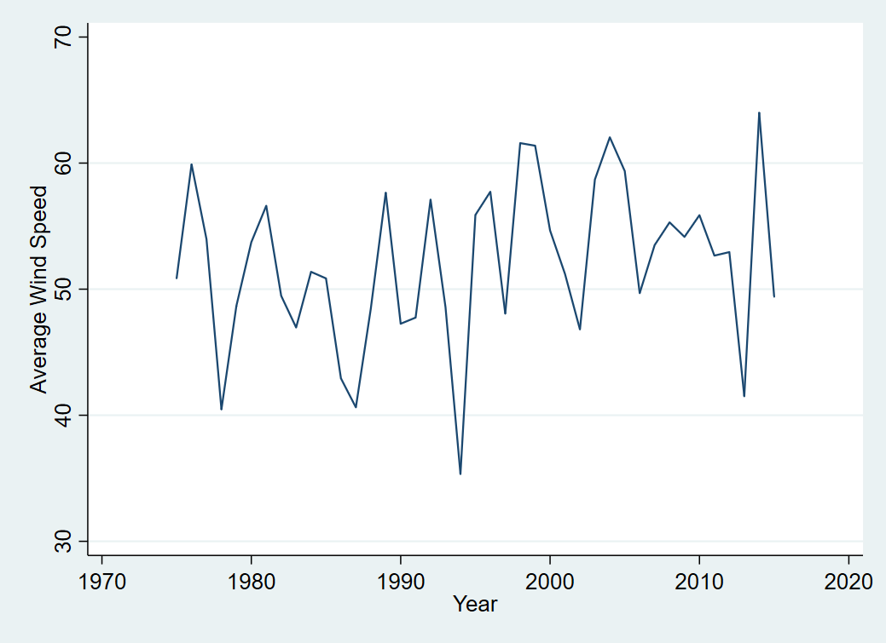
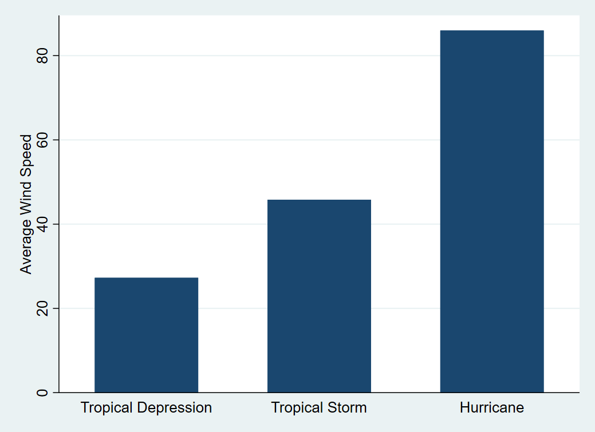

# Graphing a By-Group or Over-Time Summary Statistic

A common task in exploring or presenting data is looking at by-group summary statistics. This commonly takes the form of a graph where the group is along the x-axis and the summary statistic is on the y-axis. Often this group might be a time period so as to look at changes over time. Producing such a graph requires three things:

1. A decision of what kind of graph will be produced (line graph, bar graph, scatterplot, etc.)
1. The creation of the grouped summary statistic
1. The creation of the graph itself

## Keep in Mind

- Line graphs are only intended for use in cases where the x-axis variable (1) is *ordinal* (one value is "more" than another), and (2) takes *consistently-sized jumps* from one observation to the next. A time-based x-axis is a good candidate for use with line graphs. If your group is *categorical* and doesn't follow a natural ordering, then do not use a line graph. Consider a bar graph or some other kind of graph instead.
- If you are making a graph for presentation rather than exploration, and your x-axis variable is categorical and doesn't have a natural ordering, your graph will often be easier to read if the x-axis is sorted by the height of the y-axis. The way to do this will be demonstrated in the code examples below.

## Also Consider

- This page will cover how to calculate the summary statistic in the graph code itself. However, an alternate approach that provides a bit more control and flexibility is to calculate the by-group summary statistic by [collapsing the data set]({{ "/Data_Manipulation/collapse_a_data_set.html" }}) so there is only one observation per group in the data. Then, just make a regular graph of whatever kind you like, with the group along the x-axis, and the summary statistic on the y-axis. See [Line Graphs]({{ "/Presentation/Figures/line_graphs.html" | relative_url }}) or [Bar Graphs]({{ "/Presentation/Figures/bar_graphs.html" | relative_url }}).
- If you want a version of these graphs that has two groupings - one group along the x-axis and with different bars or lines for another group, see how to graph multiple lines on [Line Graphs]({{ "/Presentation/Figures/line_graphs.html" | relative_url }}) or multiple bars per x-axis point on [Bar Graphs]({{ "/Presentation/Figures/bar_graphs.html" | relative_url }}).


# Implementations

## R

```r
# We want ggplot2 for graphing and dplyr for the storms data
library(tidyverse)
data(storms)

# First, a line graph with time on the x-axis
# This uses stat_summary
# Note that stat_summary_bin is also available,
# which first bins the x-axis, if desired
# Put the time variable in the x aesthetic, and the 
# variable to be summarized in y
ggplot(storms, aes(x = year, y = wind)) + 
  stat_summary(geom = 'line', # Do we want a line graph? Point?
               fun = mean) + # What function should be used to summarize?
                # Note another good option for geom is 'pointrange', the default
                # which you can get from just stat_summary(),
                # which also shows the range of data
  # Just decoration:
  labs(x = 'Year', y = 'Average Wind Speed', title = 'Average Wind Speed of Storms by Year') + 
  theme_minimal()

# Second, a bar graph with a category on the x-axis
# Use reorder() to sort by which status has the most wind
ggplot(storms, aes(x = reorder(status,-wind), y = wind)) + 
  stat_summary(geom = 'bar', # Do we want a line graph? Point?
               fun = mean) +
  # Decoration:
  scale_x_discrete(labels = c('Hurricane','Tropical Storm','Tropical Depression')) + # make the labels more presentable
  # Decoration:
  labs(x = NULL, y = 'Average Wind Speed', title = 'Average Wind Speed by Storm Type') + 
  theme_minimal()
```

This code produces:




## Stata

In Stata there is not a single graph command that will graph a summary statistic line graph for us (although there is for bar graphs). Instead, for line graphs, we must [collapse the data set]({{ "/Data_Manipulation/collapse_a_data_set.html" }}) and graph the result. You could avoid collapsing by instead using `bysort group: egen newvar = mean(oldvar)` (or some egen function from `help egen` other than `mean`) to create by-group statistics in the original data, use `egen tag = tag(group)` to select only one observation per group, and then do the below graphing commands while adding `if tag == 1` to them.

```stata
** Read in the data
import delimited "https://vincentarelbundock.github.io/Rdatasets/csv/dplyr/storms.csv", clear

* Keep the original data to return to after collapsing
preserve
* First, a line graph with time on the x-axis and average wind on y
collapse (mean) wind, by(year)

* Then, a line graph
tw line wind year, xtitle("Year") ytitle("Average Wind Speed")

restore


* Now, a bar graph with a category on the x-axis
graph bar (mean) wind, over(status, relabel(1 "Hurricane" 2 "Tropical Depression" 3 "Tropical Storm") ///  Relabel the statuses to capitalize
	sort((mean) wind)) /// Put in height order automatically
	ytitle("Average Wind Speed") 
```

This code produces:




