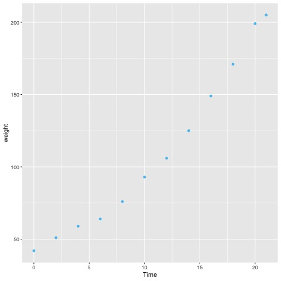
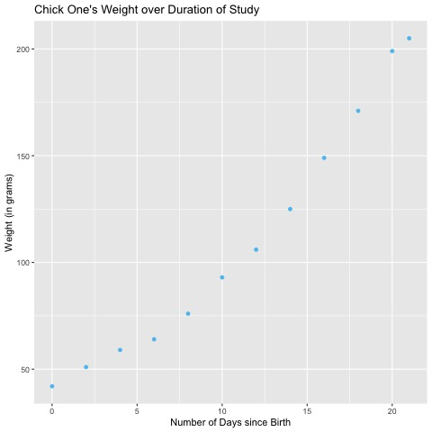
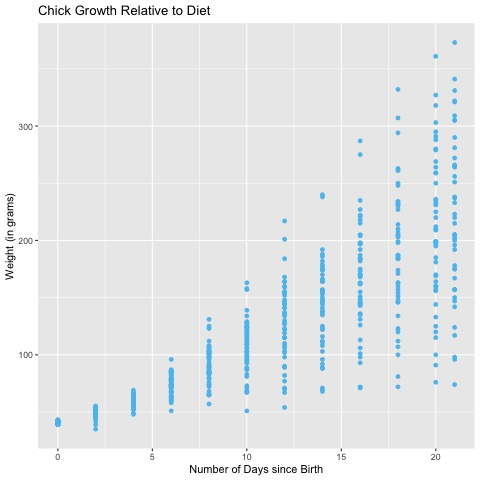
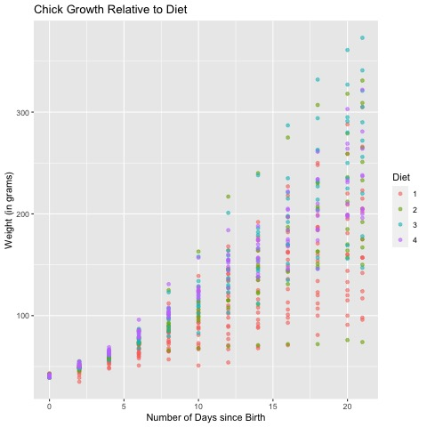
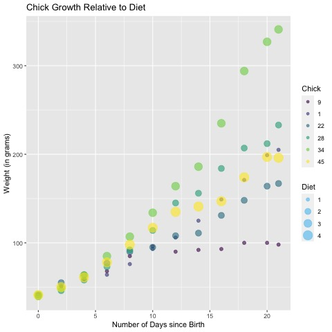
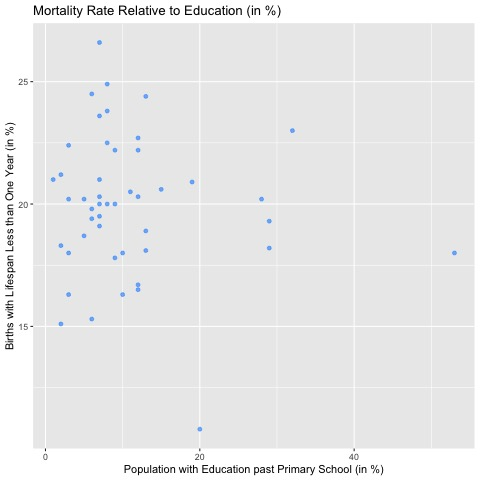
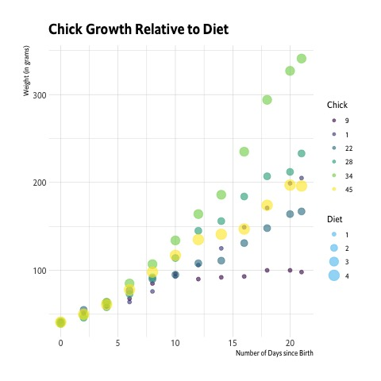

# Graph Themes

Graphs, when utilized correctly, are powerful tools that enable a user to display and visualize data and/or statistical results. Often,
graphs can lack a *human* touch; coloration, design and appearance are all important elements to consider when creating a graph that will be
used for presentation. When left untouched, our results can be bland and somewhat unexciting, and possibly more difficult to interpret.

# Keep in Mind

**The Essentials**

1.  Title: A title is used to elucidate the general relationship and/or results being displayed.
2.  Axis Labels: Axis labels define the variables used in our graph; it is often preferred to include units of these measurements as well.
3.  Legends (depending on data): Particularly when dealing with multiple observations on one graph, legends are paramount to interpretation. See more on legend creation/formatting [here](https://lost-stats.github.io/Presentation/formatting_graph_legends.html).

# Also Consider

Along with the essentials, there are a number of additional components to a graph that can make it more appealing. By accessing the colorbook found [here](http://sape.inf.usi.ch/quick-reference/ggplot2/colour), users can pick and choose from a variety of color schemes and
combinations. Another component of a graph is an attractive and professional design. 

# Implementations

## R

Begin by installing the necessary packages found below, or if previously installed, by calling them.

```r
library(ggplot2)
library(hrbrthemes)
```

Let’s use a built in data set provided by R, *ChickWeight*, which comes from an experiment on the effect of diet on early growth chicks.

```r
chick_weight = data.frame(ChickWeight)

#If we want to get a better understanding of the data set we are working with, we can use ? to see a basic overall description and description of variables.
?ChickWeight
```

Now let’s create a simple figure, without changing any theme to get an idea of what our unedited graph will look like. Let’s observe *chick
1’s* weight over time.

```r
fig1 = ggplot(data = chick_weight[chick_weight$Chick == 1,], aes(x=Time, y=weight)) + geom_point()
fig1
```


Without a title, axis labels and units of measurement it is impossible for an outsider to understand what this graph represents. What is this graph displaying? How is time recorded? What is weight measured in? Let’s add our **essentials**.

```r
#We can access axis and title labels with the labs() function
fig2 = ggplot(data = chick_weight[chick_weight$Chick == 1,], aes(x=Time, y=weight)) + 
        geom_point() + 
        labs(x="Number of Days since Birth", y= "Weight (in grams)", title = "Chick One's Weight over Duration of Study")
fig2
```



Although our graph is still very basic, it is now at least interpretable. Let’s quickly look at a case where adding a legend would
be essential: examining chick growth based on diet recieved (a factor level ranging from 1 to 4).

```r
fig3 = ggplot(data = chick_weight, aes(x=Time, y=weight)) + 
        geom_point() + 
        labs(x="Number of Days since Birth", y= "Weight (in grams)", title = "Chick Growth Relative to Diet")
fig3
```



Although we have added a title and axis labels, we are still left with a useless graph. Which point indicates which diet? It is impossible to even visually observe any trends in diet. Let’s now add a legend.

```r
fig4 = ggplot(data = chick_weight, aes(x=Time, y=weight, color = Diet)) + 
        geom_point(alpha = 0.6) + 
        labs(x="Number of Days since Birth", y= "Weight (in grams)", title = "Chick Growth Relative to Diet")
#We can assign an 'alpha' to each point so that points stacked on top of each other are more readable.
fig4
```



The data is still somewhat messy, due to clumping of data points, but we can now see which diet chicks had at each point in time. Let’s observe other legend additions that can be beneficial when working with certain data sets. For simplicity, let’s subset our data to include 6 random chicks.

```r
sub_chick_weight = chick_weight[chick_weight$Chick %in% c(1,28,34,22,45,9),]

fig5 = ggplot(data = sub_chick_weight, aes(x=Time, y=weight, color = Diet)) + 
        geom_point(alpha = 0.6) + 
        labs(x="Number of Days since Birth", y= "Weight (in grams)", title = "Chick Growth Relative to Diet")
fig5
```


This isn’t awful, but it would be nice to know which chick respective to each diet was actually being recorded. In this example it is fairly easy to see the growth of individual chicks, there are not any large discontinuous jumps or crossings of chicks with the same diet. When
working with larger data sets this issue may be magnified on a much larger scale. Let’s assign a *size* characteristic to our mapping.

```r
#Typically, you want to assign size to the variable with less values than color so that your graph is more readable. We switch diet to size and use chick as our color.
fig6 = ggplot(data = sub_chick_weight, aes(x=Time, y=weight, size = Diet, color = Chick)) + 
        geom_point(alpha = 0.6) + 
        labs(x="Number of Days since Birth", y= "Weight (in grams)", title = "Chick Growth Relative to Diet") + scale_size_discrete()
#We are using scale_size_discrete() because the variable we assigned to our size component is a discrete factor, not a continuous variable.
fig6
```



Earlier, it may have proven difficult to determine which chick that was fed *diet 1* showed the larger growth after roughly 10 days… By using both size and color to map our points, we can track individual chicks much more easily. Again, this issue is rather minute here and can be much more detrimental to other data sets.

### Sidenote

Although we applied our size component to a discrete variable, it is typically better applied to continuous ones. Let’s take a quick step
back and use this procedure for another data set in base R: *swiss*. This data set observes fertility measure and socio-economic indicators
for 47 French-speaking provinces in Switzerland in the year 1888. Let’s add some color to our points, accessing our [colorbook](http://sape.inf.usi.ch/quick-reference/ggplot2/colour).

```r
#To change color of a simple point, we add the color option to geom_point().
fig7 = ggplot(data = swiss, aes(x=Education, y=Infant.Mortality)) + 
        geom_point(color = "dodgerblue",alpha = 0.6) + 
        labs(x="Population with Education past Primary School (in %)", y= "Births with Lifespan Less than One Year (in %)", title = "Mortality Rate Relative to Education (in %)")
fig7
```



This is fine, but let’s say we believed the percent of males in agriculture as an occupation had an effect on infant mortality rates. We
can use the size component of our mapping instead of plotting the points on top of each other.

```r
fig8 = ggplot(data = swiss, aes(x=Education, y=Infant.Mortality, size = Agriculture)) + 
        geom_point(color = "dodgerblue",alpha = 0.6) + 
        labs(x="Population with Education past Primary School (in %)", y= "Births with Lifespan Less than One Year (in %)", title = "Mortality Rate Relative to Education (in %)")
fig8
```


Clearly in this case it is too difficult to determine if agricultural occupation has an effect on mortality rates, but it is nice to have the ability to visualize this data with an additional variable in mind.

## hrbrthemes

Now let’s take a look at what the **hrbrthemes** package has to offer. We’ve gone over the essentials and some coloring/sizing, but
**hrbrthemes** is a nice tool to make the overall theme of the graph more appealing and professional. Say we are happy with `fig6` but we want to make it prettier. By calling **hrbrthemes** we can choose from a variety of pre-downloaded themes with previously constructed options.

```r
#Modern Roboto-Condensed
fig9 = fig6 + hrbrthemes::theme_modern_rc()  
fig9
```


```r
fig10 = fig6 + hrbrthemes::theme_ipsum_es()  
fig10
```



```r
fig11 = fig6 + hrbrthemes::theme_tinyhand() 
fig11
```


These themes have set fonts, grid structures, axis colors and dozens of more features to simplify the process on our end. By combing the
knowledge we built in the first section of our implementation with **hrbrthemes**, we are a big leap forward in producing beautiful graphs
and designs!

Congratulations and good luck with your presentations!
