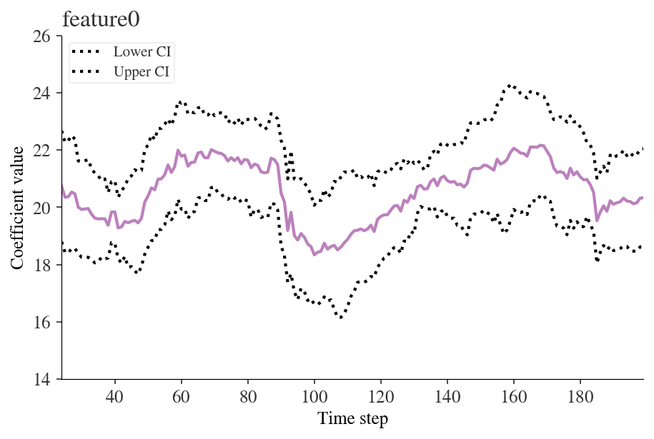
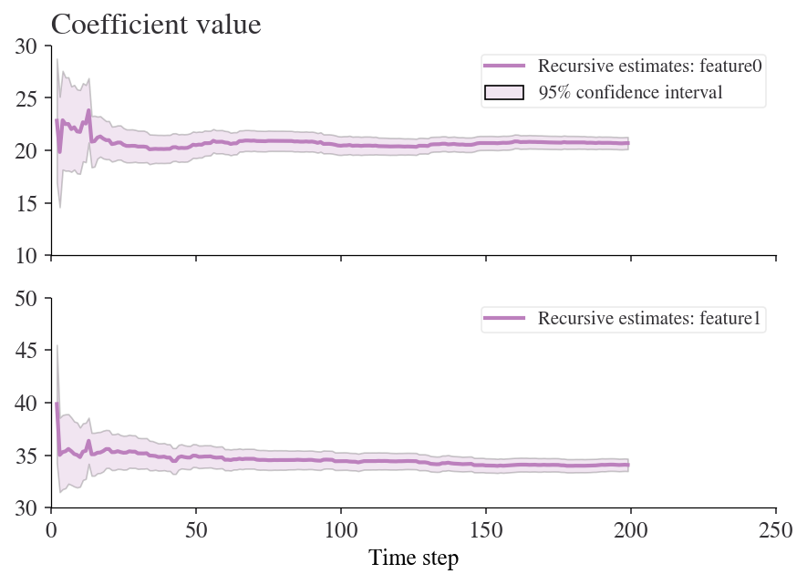

# Rolling Regression

Rolling regressions are one of the best and simplest models to to analyze changing relationships among variables overtime. It utilize the linear regression but allows certain parts of the data set used to constantly change. In most linear regression models parameters are assumed to be time-invariant and thus should not change overtime. Rolling regression can test this by finding a models parameters using a fixed window of time over the entire data set. A larger sample size, or window, used will result in less less parameter estimates but utilize more observations. For more information, see [Base on Rolling](https://factorpad.com/fin/glossary/rolling-regression.html#:~:text=Rolling%20Regression%20is%20an%20analysis,generated%20from%20a%20linear%20regression.&text=For%20context%2C%20recall%20that%20measures,in%20Finance%20change%20over%20time.)

## Keep in Mind
- When setting the width of your rolling regression you are also creating the starting position of your analysis given that it needs the a window sized amount of data begin.

## Also Consider
- An expanding window can be used where instead of a constantly changing fixed window, the regression starts with a predetermined time and then continually adds in other observations until the entire data set is used.


# Implementation

## Python

This example will make use of the [**statsmodels**](https://www.statsmodels.org/stable/index.html) package, and some of the description of rolling regression has benefitted from the documentation of that package.

Rolling ordinary least squares applies OLS (ordinary least squares) across a fixed window of observations and then rolls (moves or slides) that window across the data set. The key parameter is `window`, which determines the number of observations used in each OLS regression.

First, let's import the packages we'll be using. If you don't already have these installed, open up your terminal (aka command line) and use the command `pip install packagename` where 'packagename' is the package you want to install.


```python?example=rolling
from statsmodels.regression.rolling import RollingOLS
import statsmodels.api as sm
from sklearn.datasets import make_regression
import matplotlib.pyplot as plt
import pandas as pd
```

Next we'll create some random numbers to do our regression on


```python?example=rolling
X, y = make_regression(n_samples=200, n_features=2, random_state=0, noise=4.0,
                       bias=0)
df = pd.DataFrame(X).rename(columns={0: 'feature0', 1: 'feature1'})
df['target'] = y
df.head()
```

<div>
<table border="1" class="dataframe">
  <thead>
    <tr style="text-align: right;">
      <th></th>
      <th>feature0</th>
      <th>feature1</th>
      <th>target</th>
    </tr>
  </thead>
  <tbody>
    <tr>
      <th>0</th>
      <td>-0.955945</td>
      <td>-0.345982</td>
      <td>-36.740556</td>
    </tr>
    <tr>
      <th>1</th>
      <td>-1.225436</td>
      <td>0.844363</td>
      <td>7.190031</td>
    </tr>
    <tr>
      <th>2</th>
      <td>-0.692050</td>
      <td>1.536377</td>
      <td>44.389018</td>
    </tr>
    <tr>
      <th>3</th>
      <td>0.010500</td>
      <td>1.785870</td>
      <td>57.019515</td>
    </tr>
    <tr>
      <th>4</th>
      <td>-0.895467</td>
      <td>0.386902</td>
      <td>-16.088554</td>
    </tr>
  </tbody>
</table>
</div>


Now let's fit the model using a formula and a `window` of 25 steps.


```python?example=rolling
roll_reg = RollingOLS.from_formula('target ~ feature0 + feature1 -1', window=25, data=df)
model = roll_reg.fit()
```

Note that -1 just suppresses the intercept. We can see the parameters using `model.params`. Here are the params for time steps 20 to 30:


```python?example=rolling
model.params[20:30]
```


<div>
<table border="1" class="dataframe">
  <thead>
    <tr style="text-align: right;">
      <th></th>
      <th>feature0</th>
      <th>feature1</th>
    </tr>
  </thead>
  <tbody>
    <tr>
      <th>20</th>
      <td>NaN</td>
      <td>NaN</td>
    </tr>
    <tr>
      <th>21</th>
      <td>NaN</td>
      <td>NaN</td>
    </tr>
    <tr>
      <th>22</th>
      <td>NaN</td>
      <td>NaN</td>
    </tr>
    <tr>
      <th>23</th>
      <td>NaN</td>
      <td>NaN</td>
    </tr>
    <tr>
      <th>24</th>
      <td>20.736214</td>
      <td>35.287604</td>
    </tr>
    <tr>
      <th>25</th>
      <td>20.351719</td>
      <td>35.173493</td>
    </tr>
    <tr>
      <th>26</th>
      <td>20.368027</td>
      <td>35.095621</td>
    </tr>
    <tr>
      <th>27</th>
      <td>20.532655</td>
      <td>34.919468</td>
    </tr>
    <tr>
      <th>28</th>
      <td>20.470171</td>
      <td>35.365235</td>
    </tr>
    <tr>
      <th>29</th>
      <td>20.002261</td>
      <td>35.666997</td>
    </tr>
  </tbody>
</table>
</div>


Note that there aren't parameters for entries between 0 and 23 because our window is 25 steps wide. We can easily look at how any of the coefficients are changing over time. Here's an example for 'feature0'.


```python?example=rolling
fig = model.plot_recursive_coefficient(variables=['feature0'])
plt.xlabel('Time step')
plt.ylabel('Coefficient value')
plt.show()
```





### Recursive ordinary least squares (aka expanding window rolling regression)

A rolling regression with an *expanding* (rather than *moving*) window is effectively a recursive least squares model. We can perform this kind of estimation using the `RecursiveLS` function from **statsmodels**. Let's fit this to the whole dataset:


```python?example=rolling
reg_rls = sm.RecursiveLS.from_formula(
    'target ~ feature0 + feature1 -1', df)
model_rls = reg_rls.fit()
print(model_rls.summary())
```

                               Statespace Model Results                           
    ==============================================================================
    Dep. Variable:                 target   No. Observations:                  200
    Model:                    RecursiveLS   Log Likelihood                -570.923
    Date:                Sun, 23 May 2021   R-squared:                       0.988
    Time:                        17:05:03   AIC                           1145.847
    Sample:                             0   BIC                           1152.444
                                    - 200   HQIC                          1148.516
    Covariance Type:            nonrobust   Scale                           17.413
    ==============================================================================
                     coef    std err          z      P>|z|      [0.025      0.975]
    ------------------------------------------------------------------------------
    feature0      20.6872      0.296     69.927      0.000      20.107      21.267
    feature1      34.0655      0.302    112.870      0.000      33.474      34.657
    ===================================================================================
    Ljung-Box (Q):                       40.19   Jarque-Bera (JB):                 3.93
    Prob(Q):                              0.46   Prob(JB):                         0.14
    Heteroskedasticity (H):               1.17   Skew:                            -0.31
    Prob(H) (two-sided):                  0.51   Kurtosis:                         3.31
    ===================================================================================
    
    Warnings:
    [1] Parameters and covariance matrix estimates are RLS estimates conditional on the entire sample.


But now we can look back at how the values of the coefficients changed in real time:


```python?example=rolling
fig = model_rls.plot_recursive_coefficient(range(reg_rls.k_exog), legend_loc='upper right')
ax_list = fig.axes
for ax in ax_list:
    ax.set_xlim(0, None)
ax_list[-1].set_xlabel('Time step')
ax_list[0].set_title('Coefficient value');
```




## R

In R the **rollRegres** (one s, not two) package has a fast and efficient way to compute rolling regressions while being able to specify the linear regression, window size, whether you want a rolling or expanding window, the minimum number of observations required in a window and others.

```r?example=roll_regress
#Load in the packages
library(pacman)
p_load(rollRegres,tidyr,dplyr)
```

The data will be manually created where x can be interpreted as any independent variable over a fixed time period, and y is an outcome variable.
```r?example=roll_regress
#Simulate data
set.seed(29132867)
n <- 200
p <- 2
X <- cbind(1, matrix(rnorm(p * n), ncol = p))
y <- drop(X %*% c(1, -1, 1)) + rnorm(n)
df_1 <- data.frame(y, X[, -1])

#Run the rolling regression (Rolling window)
roll_rolling <- roll_regres(y ~ X1, df_1, width = 25L,do_downdates = TRUE)

#Check the first 10 coefficients
roll_rolling$coefs %>% tail(25)
```


To demonstrate the note about a starting position for your analysis, these are all blank because there aren't enough lags in the data for them to be included.

```?example=roll_regress
#Check the first 25 coefficients
roll_rolling$coefs %>% head(25)
```

Finally, we can show the different results when using an expanding window

```?example=roll_regress
#Run the rolling regression (Rolling window)
roll_expanding <- roll_regres(y ~ X1, df_1, width = 25L,do_downdates = FALSE)

#Check the last 10 coefficients
roll_expanding$coefs %>% tail(10)
```


